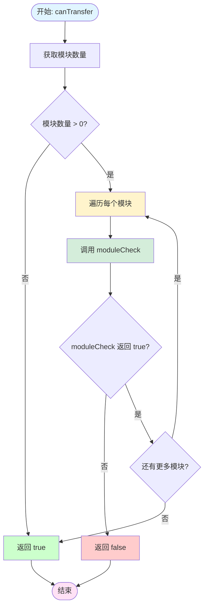

# canTransfer 函数流程图

```mermaid
flowchart TD
    Start(["开始: canTransfer"]) --> GetLength["获取模块数量<br/>"]
    GetLength --> CheckLength{"模块数量 > 0?"}
    
    CheckLength -->|"否"| ReturnTrue["返回 true"]
    CheckLength -->|"是"| LoopModules["遍历每个模块<br/>"]
    
    LoopModules --> ModuleCheck["调用 moduleCheck<br/>"]
    ModuleCheck --> CheckResult{"moduleCheck 返回 true?"}
    
    CheckResult -->|"否"| ReturnFalse["返回 false"]
    CheckResult -->|"是"| CheckNext{"还有更多模块?"}
    
    CheckNext -->|"是"| LoopModules
    CheckNext -->|"否"| ReturnTrue
    
    ReturnFalse --> End(["结束"])
    ReturnTrue --> End
    
    style Start fill:#e1f5ff
    style End fill:#ffe1f5
    style ReturnFalse fill:#ffcccc
    style ReturnTrue fill:#ccffcc
    style LoopModules fill:#fff4cc
    style ModuleCheck fill:#d4edda
```

