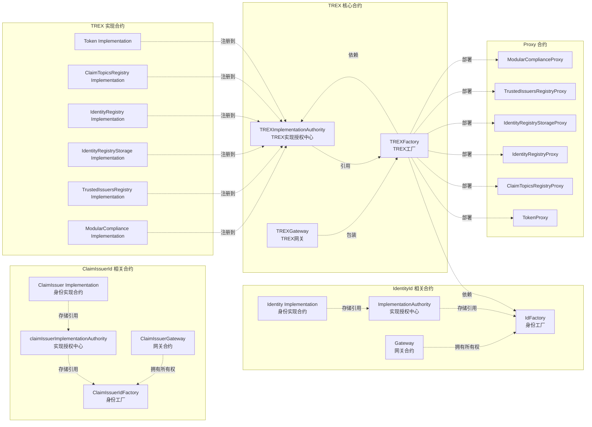
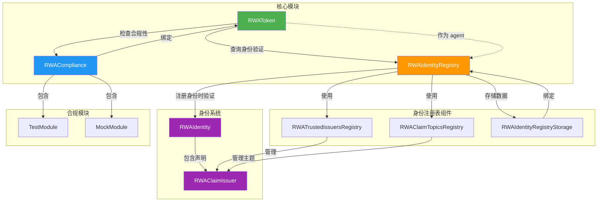

# TREX 合约部署逻辑与关系

本文档基于`DeployERC3643.s.sol` 部署脚本，描述合约之间的部署顺序和关系。

## 合约依赖关系图


   
## 部署顺序详解

### 第一阶段: Identity Factory 部署 (`DeployERC3643.s.sol`)

1. **部署 Identity Implementation**
   - 合约: `Identity`
   - 参数: `msg.sender` (部署者), `true` (初始化状态)

2. **部署 ImplementationAuthority**
   - 合约: `ImplementationAuthority`
   - 参数: `address(identityImpl)` - Identity 实现合约地址
   - 作用: 管理 Identity 合约的实现地址

3. **部署 IdFactory**
   - 合约: `IdFactory`
   - 参数: `address(implementationAuthority)` - ImplementationAuthority 地址
   - 作用: 用于创建和管理 OnChainID 身份合约

4. **部署 Gateway**
   - 合约: `Gateway`
   - 参数: 
     - `address(idFactory)` - IdFactory 地址
     - `signers` - 签名者数组（部署脚本中为空数组）
   - 作用: 包装 IdFactory，提供访问控制

5. **转移所有权**
   - 将 `IdFactory` 的所有权转移给 `Gateway`
   - 这样 Gateway 可以控制 IdFactory 的操作

### 第一阶段（续）: ClaimIssuerId Factory 部署 (`DeployERC3643.s.sol`)

1. **部署 ClaimIssuer Implementation**
   - 合约: `RWAClaimIssuer`
   - 参数: `msg.sender` (部署者)
   - 作用: ClaimIssuer 身份的实现合约

2. **部署 claimIssuerImplementationAuthority**
   - 合约: `ImplementationAuthority`
   - 参数: `address(rwaClaimIssuerImpl)` - ClaimIssuer 实现合约地址
   - 作用: 管理 ClaimIssuer 合约的实现地址

3. **部署 ClaimIssuerIdFactory**
   - 合约: `RWAClaimIssuerIdFactory`
   - 参数: `address(claimIssuerImplementationAuthority)` - claimIssuerImplementationAuthority 地址
   - 作用: 用于创建和管理 ClaimIssuer 身份合约

4. **部署 ClaimIssuerGateway**
   - 合约: `RWAClaimIssuerGateway`
   - 参数: 
     - `address(claimIssuerIdFactory)` - ClaimIssuerIdFactory 地址
     - `signers` - 签名者数组（部署脚本中为空数组）
   - 作用: 包装 ClaimIssuerIdFactory，提供访问控制

5. **转移所有权**
   - 将 `ClaimIssuerIdFactory` 的所有权转移给 `ClaimIssuerGateway`
   - 这样 ClaimIssuerGateway 可以控制 ClaimIssuerIdFactory 的操作

### 第二阶段: TREX 核心合约部署 (`DeployERC3643.s.sol`)

1. **运行 DeployIdFactory**
   - 调用 `DeployIdFactory.run()` 获取已部署的 `IdFactory` 实例

2. **部署 TREXImplementationAuthority**
   - 合约: `TREXImplementationAuthority`
   - 参数:
     - `referenceStatus = true` - 标记为主实现授权中心
     - `trexFactory = address(0)` - 初始为空，后续设置
     - `iaFactory = address(0)` - 初始为空，后续设置
   - 作用: 管理所有 TREX 相关合约的实现地址和版本

3. **部署实现合约**
   部署以下6个实现合约：
   - `Token` - 代币实现
   - `ClaimTopicsRegistry` - 声明主题注册表实现
   - `IdentityRegistryStorage` - 身份注册表存储实现
   - `TrustedIssuersRegistry` - 可信发行者注册表实现
   - `ModularCompliance` - 模块化合规实现
   - `IdentityRegistry` - 身份注册表实现

4. **添加 TREX 版本**
   - 调用 `addTREXVersion()` 将上述6个实现合约地址注册到 `TREXImplementationAuthority`
   - 版本信息: `Version(4, 0, 0)`
   - 包含所有实现合约地址的结构体 `TREXContracts`

5. **激活 TREX 版本**
   - 调用 `useTREXVersion()` 激活刚添加的版本
   - 激活后，getter 方法可以返回实现地址

6. **部署 TREXFactory**
   - 合约: `TREXFactory`
   - 参数:
     - `address(trexImplementationAuthority)` - TREX实现授权中心地址
     - `address(idFactory)` - 从第一阶段获取的 IdFactory 地址
   - 作用: 用于部署完整的 TREX 代币套件（Token + Registry + Compliance）

7. **设置 TREXFactory 引用**
   - 调用 `trexImplementationAuthority.setTREXFactory(address(trexFactory))`
   - 建立双向引用关系

8. **部署 TREXGateway**
   - 合约: `TREXGateway`
   - 参数:
     - `address(trexFactory)` - TREXFactory 地址
     - `publicDeploymentStatus = true` - 允许公开部署
   - 作用: 包装 TREXFactory，提供访问控制和部署权限管理

## 合约关系说明

### 核心关系

1. **TREXImplementationAuthority** (TREX实现授权中心)
   - **存储**: 所有6个实现合约的地址（Token, CTR, IR, IRS, TIR, MC）
   - **管理**: 版本信息（Version），支持多版本管理
   - **引用**: 存储 `TREXFactory` 地址（用于创建参考合约）
   - **功能**: 提供统一的实现地址查询接口

2. **TREXFactory** (TREX工厂)
   - **依赖**: 
     - `TREXImplementationAuthority` - 获取实现合约地址
     - `IdFactory` - 创建代币的 OnChainID 身份
   - **功能**: 部署完整的 TREX 代币套件（通过 `deployTREXSuite` 方法）

3. **TREXGateway** (TREX网关)
   - **包装**: `TREXFactory`，提供访问控制层
   - **控制**: 部署权限（通过 `publicDeploymentStatus` 参数）
   - **作用**: 作为 TREXFactory 的代理入口

4. **IdFactory** (身份工厂)
   - **依赖**: `ImplementationAuthority` - 管理 Identity 实现地址
   - **所有权**: 由 `Gateway` 拥有（部署后转移）
   - **功能**: 创建和管理 OnChainID 身份合约

5. **Proxy 合约** (运行时部署)
   - 所有6个代理合约（TokenProxy, CTRProxy, IRProxy, IRSProxy, TIRProxy, MCProxy）
   - 在构造函数中接收并存储 `TREXImplementationAuthority` 地址
   - 通过 `getImplementationAuthority()` 获取存储的IA地址
   - 在 fallback 函数中，通过IA获取对应的实现地址
   - 使用 `delegatecall` 将调用转发到实现合约

### 关键方法调用链

**TREXFactory 部署代币套件时:**
```
TREXFactory.deployTREXSuite()
  → TREXImplementationAuthority.getTokenImplementation()
  → TREXImplementationAuthority.getCTRImplementation()
  → TREXImplementationAuthority.getIRImplementation()
  → TREXImplementationAuthority.getIRSImplementation()
  → TREXImplementationAuthority.getTIRImplementation()
  → TREXImplementationAuthority.getMCImplementation()
  → IdFactory.createTokenIdentity() (创建代币身份)
```

**Proxy 合约执行调用时:**
```
用户调用 → Proxy.fallback()
  → Proxy.getImplementationAuthority()
  → TREXImplementationAuthority.getXXXImplementation()
  → delegatecall 到实现合约
```

### 升级机制

1. **版本管理**: `TREXImplementationAuthority` 支持多版本管理
   - `addTREXVersion()` - 添加新版本
   - `useTREXVersion()` - 激活指定版本
   - 所有 Proxy 合约自动使用激活版本的实现地址

2. **批量升级**: `TREXImplementationAuthority.changeImplementationAuthority()` 
   - 可以批量更新所有相关 Proxy 合约的 ImplementationAuthority 引用
   - 实现统一的升级管理

3. **参考合约**: 通过 `setTREXFactory()` 设置工厂地址后
   - TREXImplementationAuthority 可以作为参考实现授权中心
   - 其他合约可以引用它来获取标准实现地址


# Integration Test Setup 流程图

## 模块关系图

