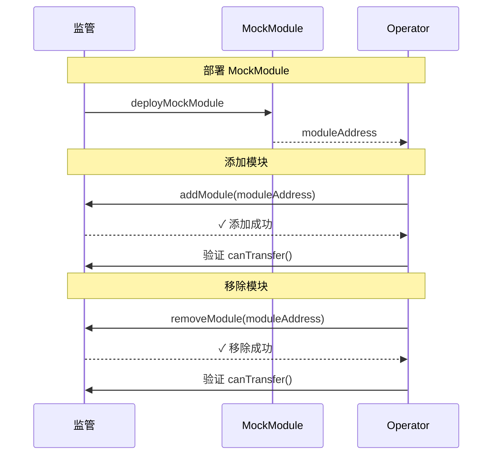

# Compliance Flow（模块增删示例）

### 业务场景举例
1.添加一个黑名单list，当to 或者from 来自于这个list，禁止转账

2.动态对用户的国籍进行限制，某个国籍的用户允许/禁止领取奖励

## 主要角色
- **Operator**：执行交易的钱包地址。
- **Factory**：`deployMockModule` 辅助函数用于部署示例模块。
- **Module**：新部署的 `MockModule`。
- **Compliance**：合规模块管理合约，支持 `addModule` / `removeModule`。

## 关键步骤对照代码
1) 初始化与校验  
- `multiTransaction.initialize(COMPLIANCE_FLOW_STEPS)` 建立 5 个 UI 步骤。  
- 缺少 `provider`/`wallet` 时直接失败返回。

2) 部署 MockModule（步骤 1）  
- `deployMockModule(provider, wallet, RPC_URL)`，成功后取得 `moduleAddress`。  
- 失败时将错误写入 `errors`，并标记步骤 `failed`。

3) 添加模块（步骤 2）  
- 先查 `compliance.isModuleBound(moduleAddress)`。  
- 未绑定则调用 `addModule`，可选使用 `trackTransactionConfirmations` 跟踪确认，`wait(2)` 后标记完成。  
- 已绑定则跳过并直接完成步骤。

4) 移除模块（步骤 3）  
- 直接 `removeModule`，等待确认后标记完成；异常则标记 `failed`。

5) 验证（步骤 4）  
- 再查 `isModuleBound` 与 `getModules()`，确认模块已移除。  
- 试调用 `canTransfer` 作为移除后的功能验证，并把结果写入 `messages`。

6) 收尾（步骤 5）  
- 将步骤 5 标记 `completed`，输出 “所有操作成功完成”。

## 成功与失败分支
- 任一步骤抛错即：  
  - `success` 置 `false`，`errors` 写入信息；  
  - 当前步骤更新为 `failed` 并携带 `error` 字段。

## 在 UI 中的呈现
- `COMPLIANCE_FLOW_STEPS`：部署 → 添加 → 移除 → 验证 → 完成。  
- `messages` 记录每个交易哈希、绑定状态与 `canTransfer` 的检查结果，便于界面展示。

