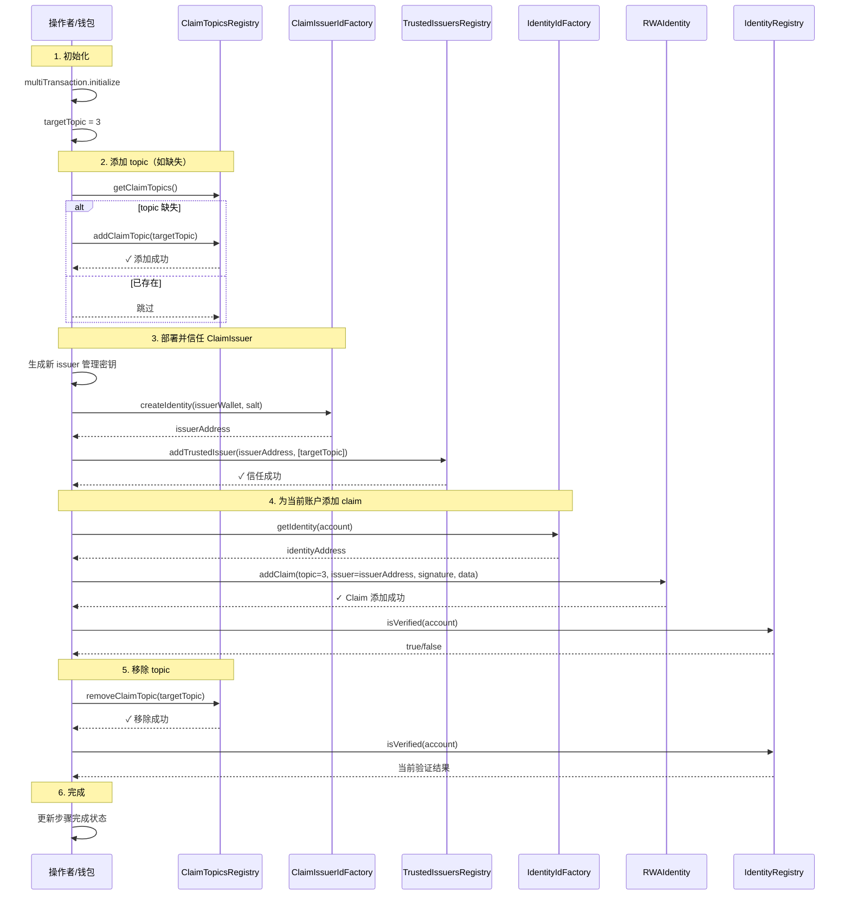

# Legal Flow（Claim Topic 管理示例）

对应 `examples/src/flows/legalFlow.ts`，演示添加/移除 claim topic、部署新的 ClaimIssuer 并为身份添加 claim 的完整链路。文档结构参考 `transferFrom_flowchart.md`：准备 → 操作 → 验证 → 收尾。

## 主要角色
- **Operator**：执行所有交易的钱包地址。
- **Topics**：`claimTopicsRegistry`，管理可用的 claim topics。
- **IssuerFactory**：`claimIssuerIdFactory`，创建新的 ClaimIssuer 身份。
- **Trusted**：`trustedIssuersRegistry`，登记可信任的 issuer 及其支持的 topics。
- **IdentityFactory**：`identityIdFactory`，查询当前账户对应的身份地址。
- **Identity**：RWA 身份合约，支持 `addClaim`。
- **Registry**：`identityRegistry`，用于验证身份是否通过。

## 关键步骤对照代码
1) 初始化与校验  
- `multiTransaction.initialize(LEGAL_FLOW_STEPS)` 创建 5 个 UI 步骤。  
- 校验 `provider`/`wallet`，缺失时直接返回错误。

2) 添加 topic（步骤 1）  
- 读取 `getClaimTopics()`，若无目标 topic=3，则执行 `addClaimTopic` 并等待 2 个确认；否则直接完成步骤。

3) 部署并信任 ClaimIssuer（步骤 2）  
- 随机生成 `issuerWallet`，用 `claimIssuerIdFactory.createIdentity` 部署 issuer 身份。  
- 使用 `addTrustedIssuer(newIssuerAddress, [targetTopic])` 将其登记为可信 issuer。  
- 两笔交易均等待确认并更新步骤状态。

4) 为账户添加 claim（步骤 3）  
- 获取当前账户的身份地址 `identityIdFactory.getIdentity(account)`。  
- 构造 `identityContract`（`RWAIdentity` ABI）并执行 `addClaim(topic=3, scheme=1, issuer, signature, data)`。  
- 使用 `signClaim` 生成签名；完成后调用 `identityRegistry.isVerified(account)` 校验。  
- 成功则将步骤标记为 `completed`。

5) 移除 topic（步骤 4）  
- 调用 `claimTopicsRegistry.removeClaimTopic(targetTopic)`，等待确认。  
- 重新读取 `getClaimTopics()` 与 `identityRegistry.isVerified(account)`，观察移除后的验证状态。

6) 完成（步骤 5）  
- 将最终步骤标记 `completed`，输出 “示例操作完成”。

## 成功与失败分支
- 任意步骤抛错：  
  - `success` 设为 `false`，`errors` 写入信息；  
  - 当前步骤标记为 `failed` 并附上 `error` 描述。

## 在 UI 中的呈现
- `LEGAL_FLOW_STEPS`：添加 Claim Topic → 部署 ClaimIssuer → 添加 Claim → 移除 Claim Topic → 完成。  
- `messages` 会展示交易哈希、issuer/identity 地址、验证结果；`errors` 用于提示异常。

