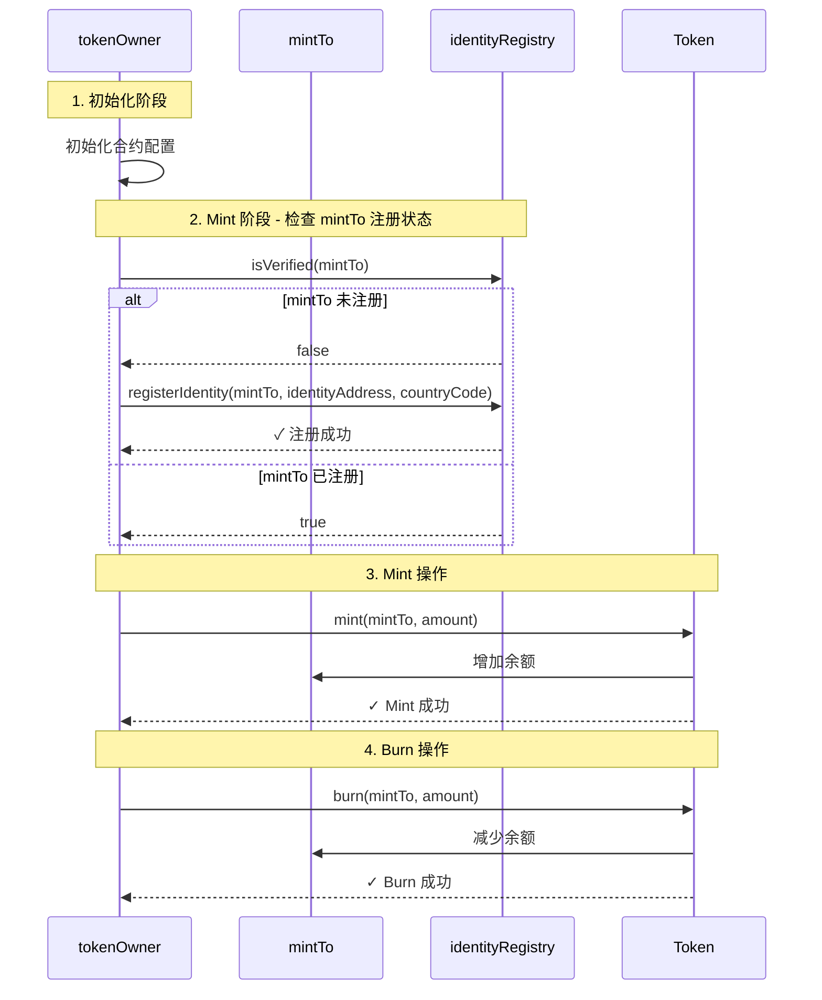

# Mint and Burn 流程图
### 业务场景举例
需要为某个业务提供初始流动性(mint)，某个业务停止使用销毁所有的流动性(burn)

## 主要角色说明

- **tokenOwner**: 执行操作的钱包地址，负责调用合约方法
- **mintTo**: 接收 mint 操作的地址，也是 transfer 操作的发送方
- **identityRegistry**: 身份注册表合约，用于验证和注册用户身份
- **Token**: 代币合约，处理 mint、burn、transfer 等操作

## 详细步骤说明

### 1. 初始化阶段
- **操作**: tokenOwner 初始化合约配置，获取合约实例
- **结果**: 准备好所有需要的合约接口和配置

### 2. Mint 阶段 - 检查 mintTo 注册状态
- **调用者**: tokenOwner
- **操作**: `identityRegistry.isVerified(mintTo)`
- **结果**: 
  - 如果未注册，调用 `registerIdentity(mintTo, identityAddress, countryCode)` 注册
  - 如果已注册，继续后续流程

### 3. Mint 操作
- **调用者**: tokenOwner
- **操作**: 
  - 获取 mint 前的余额和总供应量
  - 调用 `token.mint(mintTo, amount)` 向 mintTo mint 代币
- **结果**: mintTo 余额增加，总供应量增加

### 4. Burn 操作
- **调用者**: tokenOwner
- **操作**: `token.burn(mintTo, amount)` 从 mintTo burn 代币
- **结果**: mintTo 余额减少，总供应量减少
