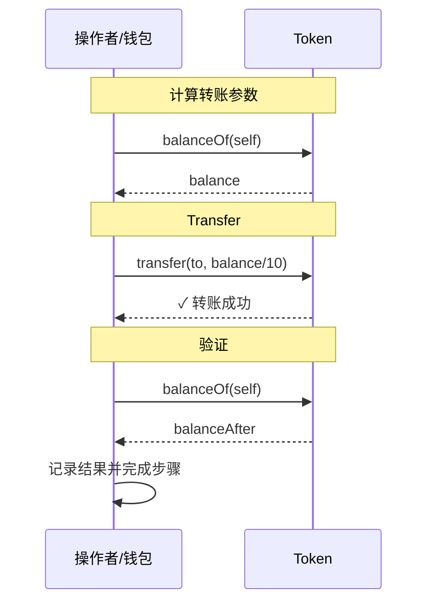

# Public Flow（单次 Transfer 示例）

基于 `examples/src/flows/publicFlow.ts`，描述示例前端如何执行一次简单的 `transfer`。流程设计参考 `transferFrom_flowchart.md` 的结构：先准备环境，再执行核心交易，最后验证结果。

## 主要角色
- **Operator**：调用交易的钱包地址，对应 `wallet.getAddress()`。
- **Token**：RWA 代币合约，执行 `balanceOf`、`transfer`。

## 关键步骤对照代码
1) 初始化（步骤 1）  
- `multiTransaction.initialize(PUBLIC_FLOW_STEPS)` 创建 2 个 UI 步骤。  
- 校验 `provider`/`wallet`，缺失则直接返回错误。

2) 计算转账数量  
- `balance = token.balanceOf(account)`，`transferAmount = balance / 10n`。  
- 将提示写入 `messages`，并通过 `setResult` 推送到界面。

3) 发起 transfer 并等待确认（步骤 1）  
- `token.transfer(transferToAddress, transferAmount)` 返回交易哈希。  
- 可选调用 `trackTransactionConfirmations` 追踪 1→12 次确认。  
- `transferTx.wait(2)` 等待 2 个确认后标记完成。

4) 结果验证与收尾（步骤 1/2）  
- 再次读取余额 `balanceOf(account)`，输出变更。  
- 更新 Step 1 状态为 `completed`，Step 2 直接标记完成，代表流程结束。

## 成功与失败分支
- 任何异常会：  
  - `success` 置为 `false`，`errors` 中写入错误信息；  
  - 当前 UI 步骤标记为 `failed`。

## 在 UI 中的呈现
- `PUBLIC_FLOW_STEPS`：  
  1. 执行 Transfer 操作  
  2. 完成转账  
- `multiTransaction` 负责状态、确认数和剩余时间提示；`messages`/`errors` 用于右侧结果面板。

