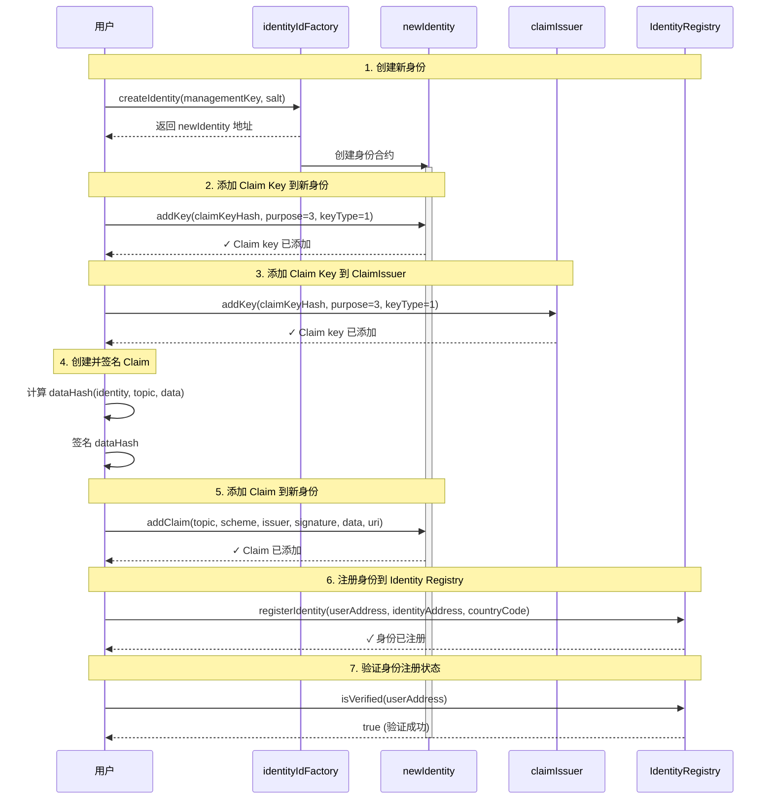

# 注册新身份流程图

## 主要交互逻辑

## 详细步骤说明

### 1. 创建新身份
- **调用者**: 用户（使用 factoryOwnerWallet）
- **操作**: `identityIdFactory.createIdentity(newManagementKey, identitySalt)`
- **结果**: 创建新的身份合约（newIdentity）

### 2. 添加 Claim Key 到新身份
- **调用者**: 用户（使用 newClaimKeyWallet）
- **操作**: `newIdentity.addKey(claimKeyHash, purpose=3, keyType=1)`
- **目的**: 为新身份添加 claim key，使其能够接收和验证 claims

### 3. 添加 Claim Key 到 ClaimIssuer
- **调用者**: 用户（使用 managementKeyWallet）
- **操作**: `claimIssuer.addKey(claimKeyHash, purpose=3, keyType=1)`
- **目的**: 授权 ClaimIssuer 使用该 claim key 来签发 claims

### 4. 创建并签名 Claim
- **操作**: 
  - 计算 `dataHash = keccak256(identity, topic, data)`
  - 添加消息前缀并签名
  - 生成 ECDSA 签名

### 5. 添加 Claim 到新身份
- **调用者**: 用户（使用 newClaimKeyWallet）
- **操作**: `newIdentity.addClaim(topic, scheme, issuer, signature, data, uri)`
- **目的**: 将已签名的 claim 添加到新身份中

### 6. 注册身份到 Identity Registry
- **调用者**: 用户
- **操作**: `identityRegistry.registerIdentity(userAddress, identityAddress, countryCode)`
- **目的**: 将新身份注册到身份注册表中

### 7. 验证身份注册状态
- **调用者**: 用户
- **操作**: `identityRegistry.isVerified(userAddress)`
- **结果**: 返回 `true` 表示身份验证成功

