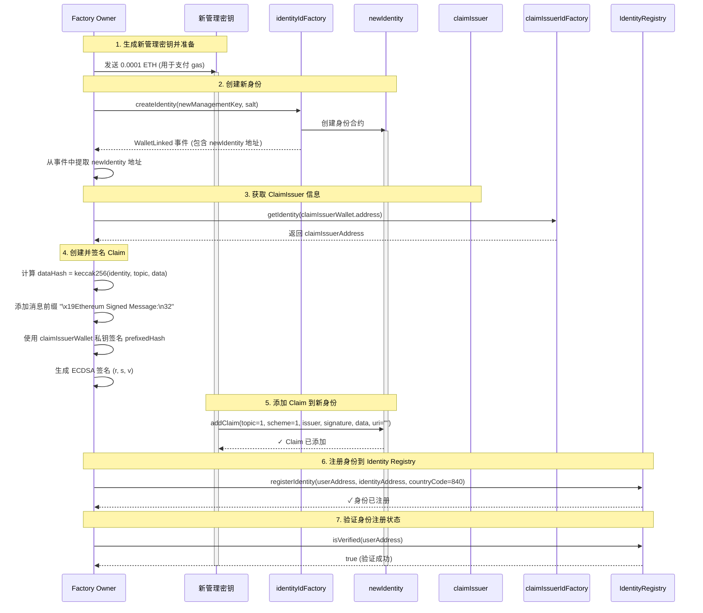

# 注册新身份流程图

## 主要交互逻辑

## 详细步骤说明

### 1. 生成新管理密钥并准备
- **操作**: 
  - 生成新的管理密钥钱包（newManagementKeyWallet）
  - Factory Owner 向新管理密钥地址发送 0.0001 ETH，用于支付后续交易的 gas 费用
- **目的**: 为新用户创建管理密钥，并确保有足够的 ETH 支付交易费用

### 2. 创建新身份
- **调用者**: Factory Owner（使用 factoryOwnerWallet）
- **操作**: `identityIdFactory.createIdentity(newManagementKey, identitySalt)`
- **结果**: 
  - 创建新的身份合约（newIdentity）
  - 从交易收据的 `WalletLinked` 事件中提取新身份地址
- **注意**: 如果 staticCall 失败，会尝试通过 `getIdentity` 方法获取地址

### 3. 获取 ClaimIssuer 信息
- **调用者**: Factory Owner
- **操作**: 
  - 使用 `CLAIM_ISSUER_PRIVATE_KEY` 创建 claimIssuerWallet
  - 通过 `claimIssuerIdFactory.getIdentity(claimIssuerWallet.address)` 获取 claimIssuerAddress
- **目的**: 获取用于签发 claim 的 ClaimIssuer 合约地址

### 4. 创建并签名 Claim
- **操作**: 
  - 计算 `dataHash = keccak256(abi.encode(identityAddress, topic=1, data="0x"))`
  - 添加消息前缀: `"\x19Ethereum Signed Message:\n32"`
  - 计算 `prefixedHash = keccak256(prefix + dataHash)`
  - 使用 `claimIssuerWallet` 的私钥对 prefixedHash 进行 ECDSA 签名
  - 生成签名字节数组 `[r, s, v]`（v 需要转换为 0-1 范围）
- **目的**: 创建由 ClaimIssuer 签名的 KYC claim，证明新身份已通过验证

### 5. 添加 Claim 到新身份
- **调用者**: 新管理密钥（使用 newManagementKeyWallet）
- **操作**: `newIdentity.addClaim(topic=1, scheme=1, claimIssuerAddress, signature, data="0x", uri="")`
- **参数说明**:
  - `topic=1`: KYC claim 主题
  - `scheme=1`: ECDSA 签名方案
  - `issuer`: ClaimIssuer 合约地址
  - `signature`: 步骤 4 中生成的签名
- **目的**: 将已签名的 claim 添加到新身份中，使身份能够通过验证

### 6. 注册身份到 Identity Registry
- **调用者**: Factory Owner
- **操作**: `identityRegistry.registerIdentity(userAddress, identityAddress, countryCode=840)`
- **参数说明**:
  - `userAddress`: 新管理密钥地址
  - `identityAddress`: 新创建的身份合约地址
  - `countryCode=840`: 国家代码（840 代表美国）
- **目的**: 将新身份注册到身份注册表中，建立用户地址与身份合约的映射关系

### 7. 验证身份注册状态
- **调用者**: Factory Owner
- **操作**: `identityRegistry.isVerified(userAddress)`
- **结果**: 返回 `true` 表示身份验证成功，用户已成功注册并可以通过合规检查

