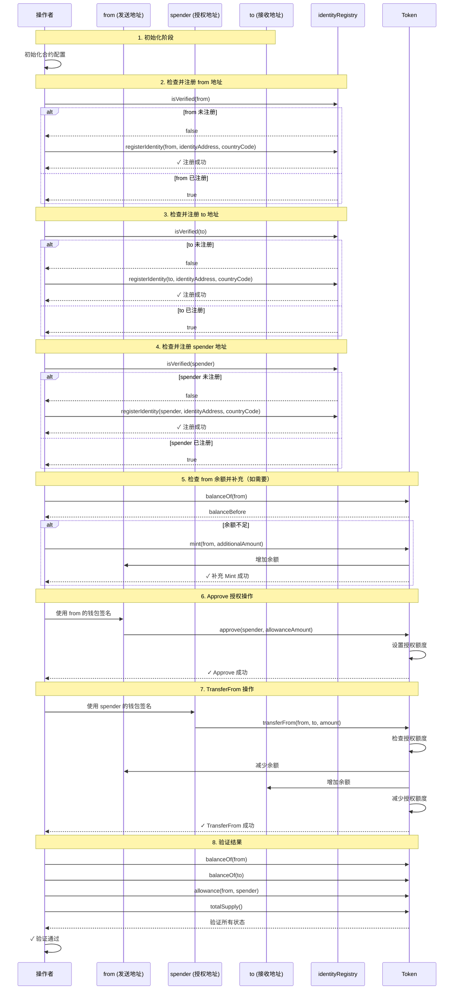

# TransferFrom 流程图

## 主要角色说明

- **操作者**: 执行操作的钱包地址，负责调用合约方法和协调整个流程
- **from**: 发送地址，代币的原始持有者，需要授权给 spender
- **spender**: 授权地址，被授权代表 from 执行转账操作
- **to**: 接收地址，transferFrom 操作的最终接收方
- **identityRegistry**: 身份注册表合约，用于验证和注册用户身份
- **Token**: 代币合约，处理 approve、transferFrom 等操作

## 详细步骤说明

### 1. 初始化阶段
- **操作**: 操作者初始化合约配置，获取合约实例和钱包
- **结果**: 准备好所有需要的合约接口、配置和钱包实例

### 2. 检查并注册 from 地址
- **调用者**: 操作者
- **操作**: `identityRegistry.isVerified(from)`
- **结果**: 
  - 如果未注册，调用 `registerIdentity(from, identityAddress, countryCode)` 注册
  - 如果已注册，继续后续流程

### 3. 检查并注册 to 地址
- **调用者**: 操作者
- **操作**: `identityRegistry.isVerified(to)`
- **结果**: 
  - 如果未注册，调用 `registerIdentity(to, identityAddress, countryCode)` 注册
  - 如果已注册，继续后续流程

### 4. 检查并注册 spender 地址
- **调用者**: 操作者
- **操作**: `identityRegistry.isVerified(spender)`
- **结果**: 
  - 如果未注册，调用 `registerIdentity(spender, identityAddress, countryCode)` 注册
  - 如果已注册，继续后续流程

### 5. 检查 from 余额并补充（如需要）
- **调用者**: 操作者
- **操作**: 
  - 检查 `token.balanceOf(from)` 是否足够
  - 如果余额不足，调用 `token.mint(from, additionalAmount)` 补充
- **结果**: 确保 from 有足够的余额进行 transferFrom

### 6. Approve 授权操作
- **调用者**: from（使用 from 的钱包签名）
- **操作**: 
  - 获取授权前的状态（from 余额、to 余额、授权额度、总供应量）
  - 调用 `token.approve(spender, allowanceAmount)` 授权 spender 使用 from 的代币
- **结果**: spender 获得授权额度，可以代表 from 执行转账

### 7. TransferFrom 操作
- **调用者**: spender（使用 spender 的钱包签名）
- **操作**: 
  - 调用 `token.transferFrom(from, to, amount)` 执行授权转账
  - 合约会检查 spender 的授权额度是否足够
- **结果**: 
  - from 余额减少
  - to 余额增加
  - spender 的授权额度减少（减少的金额等于转账金额）
  - 总供应量不变

### 8. 验证结果
- **调用者**: 操作者
- **操作**: 
  - 检查 `token.balanceOf(from)` 是否等于 `fromBalanceBefore - amount`
  - 检查 `token.balanceOf(to)` 是否等于 `toBalanceBefore + amount`
  - 检查 `token.allowance(from, spender)` 是否等于 `allowanceBefore - amount`
  - 检查 `token.totalSupply()` 是否保持不变
- **结果**: 验证所有状态变化是否符合预期

## 关键区别说明

### TransferFrom vs Transfer

- **Transfer**: 由代币持有者直接调用 `transfer(to, amount)`，从自己的账户转账给接收方
- **TransferFrom**: 由被授权的第三方（spender）调用 `transferFrom(from, to, amount)`，代表代币持有者（from）执行转账

### 授权机制

- **Approve**: from 需要先调用 `approve(spender, allowanceAmount)` 授权 spender 使用其代币
- **授权额度**: spender 可以使用的最大金额，每次 transferFrom 会减少相应的授权额度
- **授权检查**: transferFrom 操作会检查 spender 的授权额度是否足够

