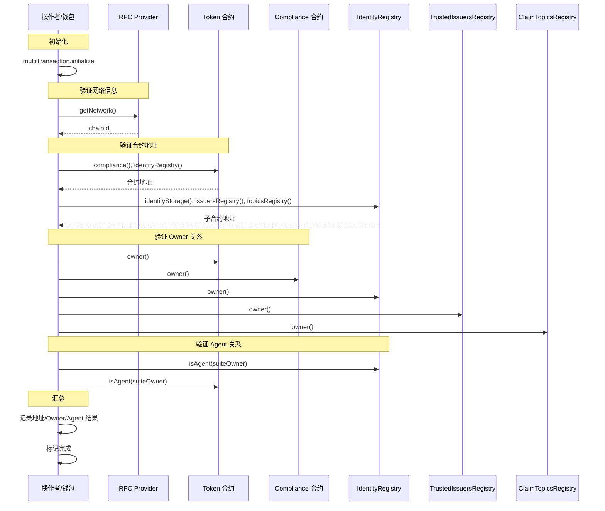

# Validate Deployment Flow（部署结果校验示例）

演示一次部署后的全链路校验：网络信息、合约地址、Owner 关系、Agent 关系与结果汇总。

## 主要角色
- **Operator**：执行校验的钱包地址。
- **Provider**：RPC 入口，提供链 ID 与读操作。
- **Token**：已部署的 RWA Token 合约。
- **Compliance**：合规模块管理合约。
- **Registry**：`identityRegistry`，身份登记与 agent 校验。
- **Trusted**：`trustedIssuersRegistry`，可信发行方注册表。
- **Topics**：`claimTopicsRegistry`，Claim Topic 注册表。

## 关键步骤对照代码
1) 初始化与前置校验  
- `multiTransaction.initialize(VALIDATE_DEPLOYMENT_STEPS)` 创建 6 个 UI 步骤。  
- 缺少 `provider`/`wallet` 时立即返回，`success=false` 并写入 `errors`。

2) 初始化合约配置（步骤 1）  
- `createContractConfig(provider, wallet, { useClaimIssuerPrivateKeys: false })` 生成合约实例与 `deploymentResults`。  
- 成功则 `updateStep(1, completed)`，写入 “合约配置初始化成功”。

3) 验证网络信息（步骤 2）  
- 读取 `provider.getNetwork()`，记录 `chainId`。  
- 成功后将步骤标记为 `completed` 并附带链 ID 信息。

4) 验证合约地址（步骤 3）  
- 从 `token` 读取 `compliance()` 与 `identityRegistry()`，并与 `deploymentResults` 比对。  
- 从 `identityRegistry` 读取 `identityStorage() / issuersRegistry() / topicsRegistry()`，逐项与部署结果匹配。  
- 任一地址不一致则 `success=false`、当前步骤 `failed`。

5) 验证 Owner 关系（步骤 4）  
- 计算 `suiteOwner`（优先 `deploymentResults.suiteOwner`，否则使用 `tokenOwner`）。  
- 调用各合约 `owner()`：`token`、`identityRegistry`、`compliance`、`trustedIssuersRegistry`、`claimTopicsRegistry`、`trexFactory`、`identityIdFactory`、`identityGateway`、`claimIssuerIdFactory`、`claimIssuerGateway`。  
- 任意不匹配即标记 `failed`，全部通过则完成步骤。

6) 验证 Agent 关系（步骤 5）  
- 检查 `identityRegistry.isAgent(suiteOwner)` 与 `token.isAgent(suiteOwner)`，缺失即失败。  
- 两项均通过则完成步骤。

7) 汇总验证结果（步骤 6）  
- 汇总 Token、IdentityRegistry、Compliance、各 Registry/Factory 与 Owner 信息。  
- 若存在 `claimIssuersCount`，遍历输出每个 ClaimIssuer 地址/Owner/ClaimTopics。  
- 记录 “所有验证通过”，并将步骤标记 `completed`。

## 成功与失败分支
- 任一步骤抛错或地址/关系不匹配：  
  - `success` 置 `false`，`errors` 写入描述；  
  - 当前步骤 `failed`，附带 `error` 字段；后续步骤停止。

## 在 UI 中的呈现
- `VALIDATE_DEPLOYMENT_STEPS`：初始化合约配置 → 验证网络信息 → 验证合约地址 → 验证 Owner 关系 → 验证 Agent 关系 → 汇总验证结果。  
- `messages` 展示链 ID、各合约地址、Owner/Agent 校验结果及 ClaimIssuer 汇总；`errors` 用于提示异常。

