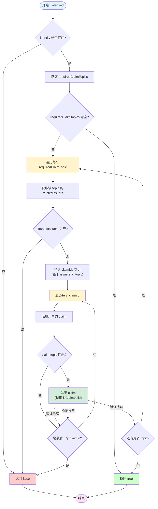

# isVerified 函数流程图

**IdentityRegistry**

```mermaid
flowchart TD
    Start(["开始: isVerified"]) --> CheckIdentity{"identity 是否存在?"}
    CheckIdentity -->|"否"| ReturnFalse["返回 false"]
    CheckIdentity -->|"是"| GetTopics["获取 requiredClaimTopics"]
    
    GetTopics --> CheckTopics{"requiredClaimTopics 为空?"}
    CheckTopics -->|"是"| ReturnTrue["返回 true"]
    CheckTopics -->|"否"| LoopTopics["遍历每个 requiredClaimTopic"]
    
    LoopTopics --> GetIssuers["获取该 topic 的 trustedIssuers"]
    GetIssuers --> CheckIssuers{"trustedIssuers 为空?"}
    CheckIssuers -->|"是"| ReturnFalse
    CheckIssuers -->|"否"| BuildClaimIds["构建 claimIds 数组<br/>(基于 issuers 和 topic)"]
    
    BuildClaimIds --> LoopClaims["遍历每个 claimId"]
    LoopClaims --> GetClaim["获取用户的 claim"]
    GetClaim --> CheckMatch{"claim topic 匹配?"}
    
    CheckMatch -->|"否"| CheckLastClaim{"是最后一个 claimId?"}
    CheckLastClaim -->|"是"| ReturnFalse
    CheckLastClaim -->|"否"| LoopClaims
    
    CheckMatch -->|"是"| ValidateClaim["验证 claim<br/>(调用 isClaimValid)"]
    ValidateClaim -->|"验证成功"| NextTopic{"还有更多 topic?"}
    ValidateClaim -->|"验证失败"| CheckLastClaim
    ValidateClaim -->|"验证异常"| CheckLastClaim
    
    NextTopic -->|"是"| LoopTopics
    NextTopic -->|"否"| ReturnTrue
    
    ReturnFalse --> End(["结束"])
    ReturnTrue --> End
    
    style Start fill:#e1f5ff
    style End fill:#ffe1f5
    style ReturnFalse fill:#ffcccc
    style ReturnTrue fill:#ccffcc
    style LoopTopics fill:#fff4cc
    style LoopClaims fill:#fff4cc
    style ValidateClaim fill:#d4edda
```

