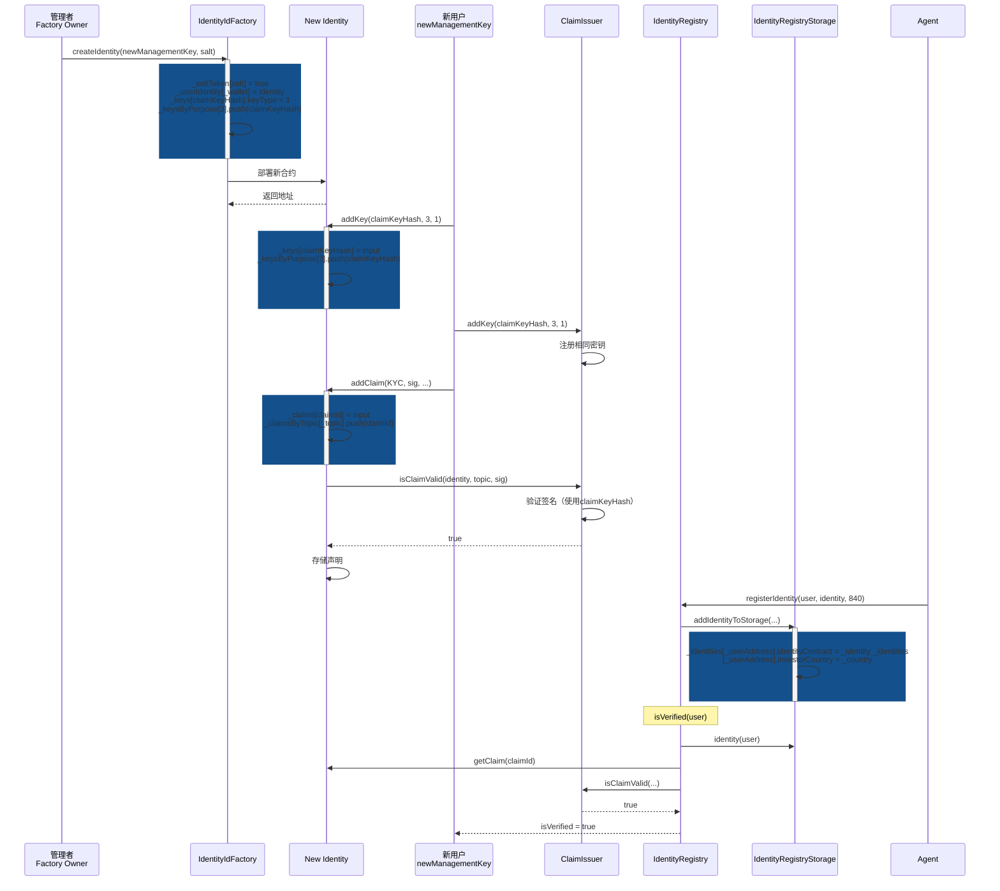

# 新增用户注册流程详解

## 概述

本文档详细说明了在 ERC-3643 合规代币系统中新增一个用户并完成身份验证的完整流程。该流程基于 `test_RegisterNewIdentity_Success` 测试用例（第90-122行）。

## 流程步骤详解

### 步骤1: 准备阶段（90-96行）

**目的**: 初始化必要的参数和密钥

```solidity
uint256 purposeClaim = 3;        // Claim签名密钥用途（ERC-734标准）
uint256 keyTypeEcdsa = 1;         // ECDSA密钥类型
uint256 claimTopicKyc = 1;        // KYC声明主题
uint256 claimSchemeEcdsa = 1;     // ECDSA签名方案
uint256 newClaimKeyPrivateKey = ...;  // 新的私钥
address newManagementKey = vm.addr(newClaimKeyPrivateKey);  // 从私钥派生地址
bytes32 claimKeyHash = keccak256(abi.encode(newManagementKey));  // 计算密钥哈希
```

**关键点**:
- `purposeClaim = 3` 表示这是用于签名声明的密钥（CLAIM signer key）
- `newManagementKey` 是用户的管理地址，将用于控制新创建的Identity
- `claimKeyHash` 是密钥的哈希值，用于在Identity合约中标识密钥

### 步骤2: 创建新Identity（98-100行）

**目的**: 通过工厂合约创建新的Identity合约实例

```solidity
vm.prank(identityIdFactory.owner());
address newIdentity = identityIdFactory.createIdentity(newManagementKey, "newIdentity");
```

**状态变化**:
- 创建了一个新的Identity合约实例
- `newManagementKey` 被设置为该Identity的管理密钥
- Identity合约地址存储在 `newIdentity` 变量中

**关键点**:
- 只有工厂合约的owner可以创建Identity
- 新创建的Identity已经包含了管理密钥（`newManagementKey`）

### 步骤3: 为新Identity添加Claim Key（102-104行）

**目的**: 在新创建的Identity上添加用于签名声明的密钥

```solidity
vm.prank(newManagementKey);
RWAIdentity(newIdentity).addKey(claimKeyHash, purposeClaim, keyTypeEcdsa);
```

**状态变化**:
- Identity合约中注册了新的密钥（`claimKeyHash`）
- 该密钥被标记为用途3（CLAIM signer key）
- 密钥类型为1（ECDSA）

**关键点**:
- 只有管理密钥（`newManagementKey`）可以添加新密钥
- 这个密钥将用于后续签名KYC声明

### 步骤4: 为ClaimIssuer添加相同的Claim Key（106-109行）

**目的**: 在ClaimIssuer上也添加相同的密钥，使其能够验证该密钥签名的声明

```solidity
address managementKey = vm.envOr("MANAGEMENT_KEY", msg.sender);
vm.prank(managementKey);
RWAClaimIssuer(claimIssuer).addKey(claimKeyHash, purposeClaim, keyTypeEcdsa);
```

**状态变化**:
- ClaimIssuer合约中也注册了相同的密钥（`claimKeyHash`）
- ClaimIssuer现在可以验证由该密钥签名的声明

**关键点**:
- 这是**关键步骤**：ClaimIssuer必须拥有相同的密钥才能验证签名
- 只有ClaimIssuer的管理密钥可以执行此操作
- 这确保了ClaimIssuer能够验证后续添加的声明签名

### 步骤5: 创建并添加KYC声明（111-118行）

**目的**: 创建KYC声明，使用私钥签名，然后添加到Identity

```solidity
// 准备声明数据
bytes memory data = "";
bytes32 dataHash = keccak256(abi.encode(newIdentity, claimTopicKyc, data));
bytes32 prefixedHash = keccak256(abi.encodePacked("\x19Ethereum Signed Message:\n32", dataHash));

// 使用私钥签名
(uint8 v, bytes32 r, bytes32 s) = vm.sign(newClaimKeyPrivateKey, prefixedHash);
bytes memory sig = abi.encodePacked(r, s, v);

// 添加声明到Identity
vm.prank(newManagementKey);
RWAIdentity(newIdentity).addClaim(claimTopicKyc, claimSchemeEcdsa, address(claimIssuer), sig, data, "");
```

**状态变化**:
- Identity合约中存储了KYC声明（topic=1）
- 声明包含ClaimIssuer地址和签名
- 声明可以被ClaimIssuer验证

**关键点**:
- 签名格式遵循EIP-191标准（`\x19Ethereum Signed Message:\n32`前缀）
- 签名内容包含：Identity地址、声明主题、声明数据
- `addClaim` 会调用ClaimIssuer的 `isClaimValid` 来验证签名
- 由于步骤4中ClaimIssuer已经添加了相同的密钥，验证会通过

### 步骤6: 注册到IdentityRegistry（120-121行）

**目的**: 将用户地址和Identity关联，并存储到IdentityRegistry

```solidity
identityRegistry.registerIdentity(newManagementKey, IIdentity(address(newIdentity)), 840);
```

**状态变化**:
- `newManagementKey` 地址与 `newIdentity` 合约关联
- 国家代码840（美国）被存储
- 用户信息被添加到IdentityRegistryStorage

**关键点**:
- 只有Agent角色可以调用 `registerIdentity`
- 840是ISO 3166-1数字国家代码（美国）

### 步骤7: 验证状态（122行）

**目的**: 验证用户是否满足所有合规要求

```solidity
assertTrue(identityRegistry.isVerified(newManagementKey));
```

**`isVerified` 检查逻辑**:
1. 检查用户是否已注册Identity（如果未注册返回false）
2. 获取所有必需的声明主题（从ClaimTopicsRegistry）
3. 如果没有必需的声明主题，返回true
4. 对于每个必需的声明主题：
   - 获取该主题的受信任发行者列表
   - 检查Identity是否有来自受信任发行者的有效声明
   - 验证声明签名是否有效
5. 如果所有必需的声明主题都有有效声明，返回true

**状态变化**:
- `isVerified(newManagementKey)` 返回 `true`
- 用户现在可以参与代币转账等操作

## 关键组件交互图



## 关键要点总结

1. **密钥对称性**: Identity和ClaimIssuer必须拥有相同的Claim Key，这是签名验证的前提
2. **签名格式**: 必须遵循EIP-191标准，包含正确的消息前缀
3. **声明验证**: `addClaim` 时会自动调用ClaimIssuer验证签名
4. **注册顺序**: 必须先完成Identity的配置（添加密钥和声明），再注册到Registry
5. **验证检查**: `isVerified` 会检查所有必需的声明主题是否都有有效声明

## 常见问题

**Q: 为什么需要在ClaimIssuer上也添加密钥？**
A: 因为 `addClaim` 时会调用 `ClaimIssuer.isClaimValid()` 来验证签名，ClaimIssuer必须拥有相同的密钥才能验证。

**Q: 如果跳过步骤4会怎样？**
A: `addClaim` 会失败，因为ClaimIssuer无法验证签名，`isClaimValid` 会返回false。

**Q: `isVerified` 检查什么？**
A: 检查用户是否已注册，以及是否拥有所有必需声明主题的有效声明（来自受信任的发行者）。

**Q: 国家代码840代表什么？**
A: 840是ISO 3166-1数字国家代码，代表美国（United States）。

