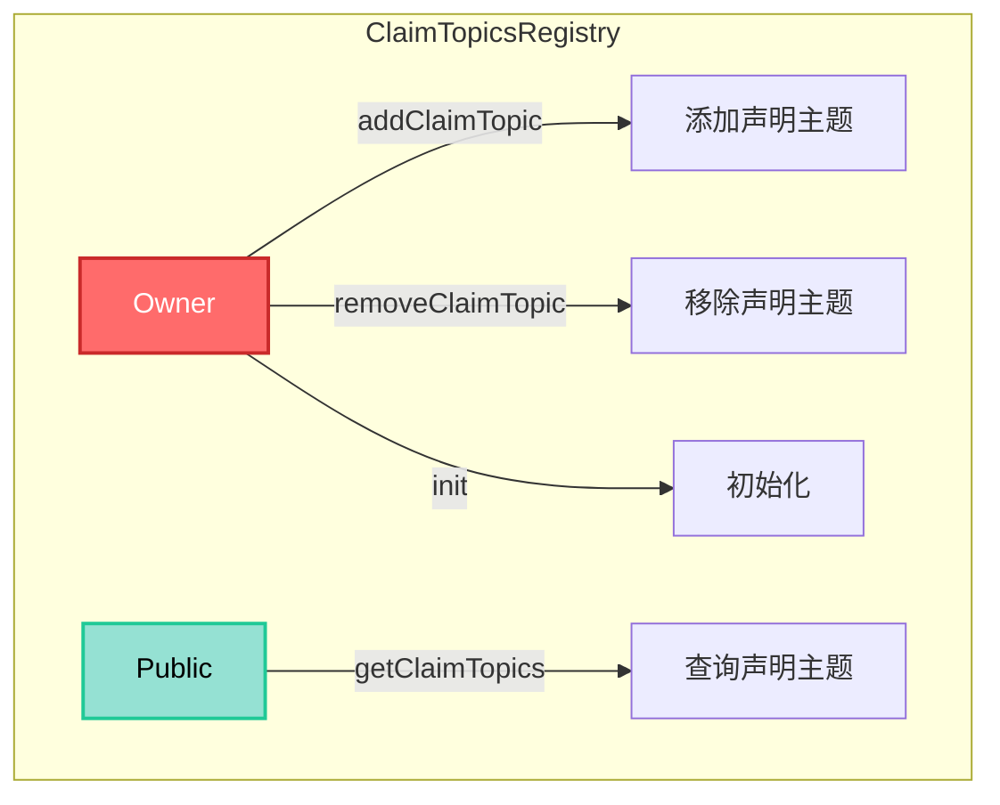
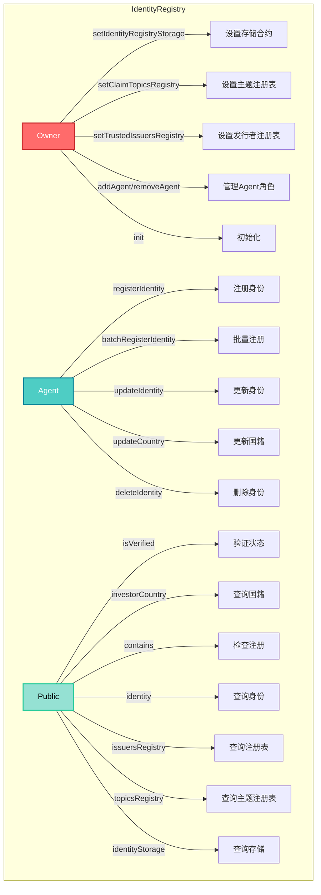
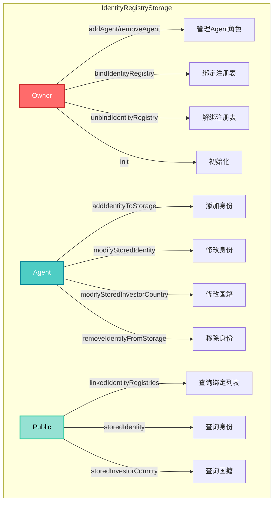
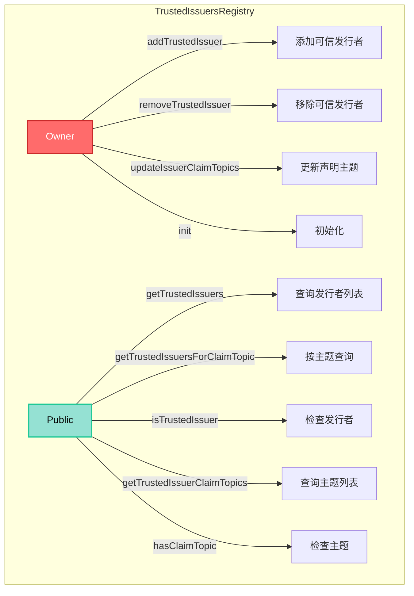
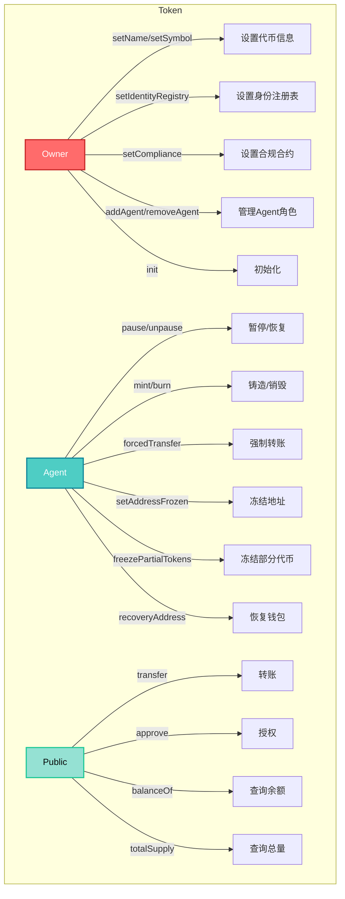
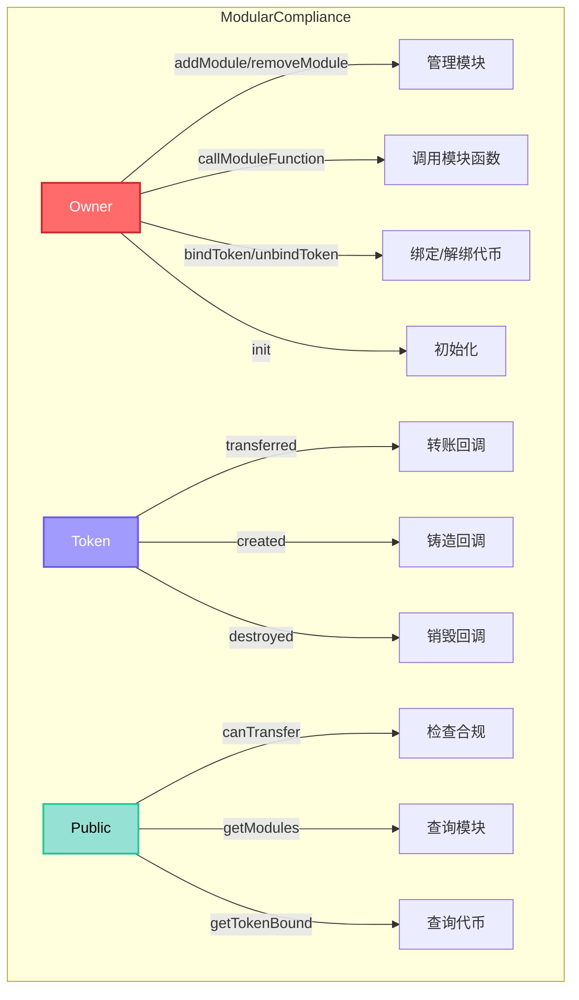
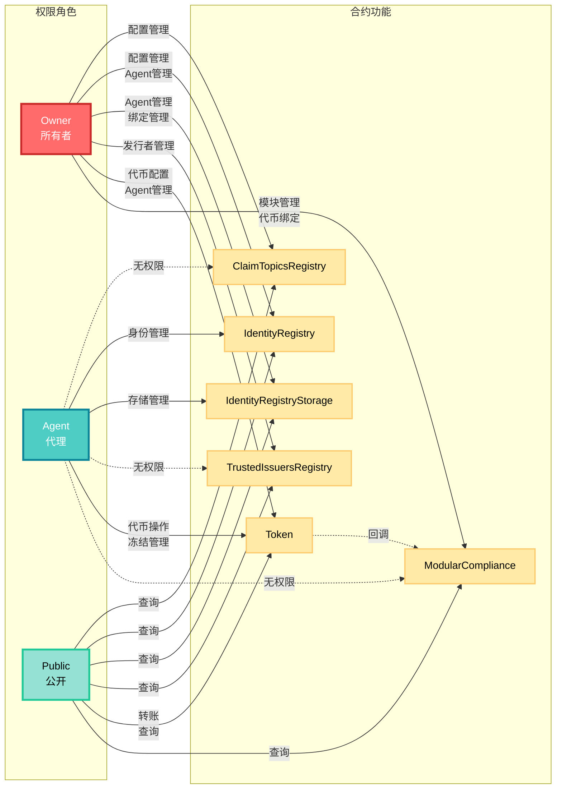

# ERC-3643 合约权限管理文档

本文档整理了以下六个核心合约的权限管理：
- `ClaimTopicsRegistry.sol`
- `IdentityRegistry.sol`
- `IdentityRegistryStorage.sol`
- `TrustedIssuersRegistry.sol`
- `Token.sol`
- `ModularCompliance.sol`

---

## 1. ClaimTopicsRegistry.sol

**继承关系：** `OwnableUpgradeable` + `CTRStorage`

### Owner 可以做的操作

1. **`addClaimTopic(uint256 _claimTopic)`**
   - 添加新的声明主题（Claim Topic）
   - 限制：最多15个主题，不能重复添加

2. **`removeClaimTopic(uint256 _claimTopic)`**
   - 移除指定的声明主题

3. **`init()`**
   - 初始化合约（仅在部署时调用一次）

### Agent 可以做的操作

- **无**（此合约不涉及 Agent 角色）

### 其他角色/公开操作

1. **`getClaimTopics()`** (view)
   - 获取所有已注册的声明主题列表
   - 任何人都可以调用

### 权限结构图



---

## 2. IdentityRegistry.sol

**继承关系：** `AgentRoleUpgradeable` + `IRStorage`

### Owner 可以做的操作

1. **`setIdentityRegistryStorage(address _identityRegistryStorage)`**
   - 设置身份注册表存储合约地址

2. **`setClaimTopicsRegistry(address _claimTopicsRegistry)`**
   - 设置声明主题注册表合约地址

3. **`setTrustedIssuersRegistry(address _trustedIssuersRegistry)`**
   - 设置可信发行者注册表合约地址

4. **`addAgent(address _agent)`** (继承自 `AgentRoleUpgradeable`)
   - 添加新的 Agent 角色

5. **`removeAgent(address _agent)`** (继承自 `AgentRoleUpgradeable`)
   - 移除 Agent 角色

6. **`init(...)`**
   - 初始化合约（仅在部署时调用一次）

### Agent 可以做的操作

1. **`batchRegisterIdentity(address[] _userAddresses, IIdentity[] _identities, uint16[] _countries)`**
   - 批量注册用户身份
   - 内部调用 `registerIdentity`

2. **`registerIdentity(address _userAddress, IIdentity _identity, uint16 _country)`**
   - 注册单个用户身份
   - 将用户地址、身份合约和国籍信息存储到 IdentityRegistryStorage

3. **`updateIdentity(address _userAddress, IIdentity _identity)`**
   - 更新用户的身份合约

4. **`updateCountry(address _userAddress, uint16 _country)`**
   - 更新用户的国籍信息

5. **`deleteIdentity(address _userAddress)`**
   - 删除用户的身份信息

### 其他角色/公开操作

以下为 view 函数，任何人都可以调用：

1. **`isVerified(address _userAddress)`** (view)
   - 检查用户是否已验证（验证身份和声明）

2. **`investorCountry(address _userAddress)`** (view)
   - 获取用户的国籍

3. **`issuersRegistry()`** (view)
   - 获取可信发行者注册表合约

4. **`topicsRegistry()`** (view)
   - 获取声明主题注册表合约

5. **`identityStorage()`** (view)
   - 获取身份注册表存储合约

6. **`contains(address _userAddress)`** (view)
   - 检查用户是否已注册

7. **`identity(address _userAddress)`** (view)
   - 获取用户的身份合约地址

### 权限结构图



---

## 3. IdentityRegistryStorage.sol

**继承关系：** `AgentRoleUpgradeable` + `IRSStorage`

### Owner 可以做的操作

1. **`addAgent(address _agent)`** (继承自 `AgentRoleUpgradeable`)
   - 添加新的 Agent 角色

2. **`removeAgent(address _agent)`** (继承自 `AgentRoleUpgradeable`)
   - 移除 Agent 角色

3. **`init()`**
   - 初始化合约（仅在部署时调用一次）

### Agent 可以做的操作

1. **`addIdentityToStorage(address _userAddress, IIdentity _identity, uint16 _country)`**
   - 向存储中添加用户身份信息
   - 限制：用户地址不能已存在

2. **`modifyStoredIdentity(address _userAddress, IIdentity _identity)`**
   - 修改已存储的用户身份合约
   - 限制：用户地址必须已存在

3. **`modifyStoredInvestorCountry(address _userAddress, uint16 _country)`**
   - 修改已存储的用户国籍
   - 限制：用户地址必须已存在

4. **`removeIdentityFromStorage(address _userAddress)`**
   - 从存储中移除用户身份信息
   - 限制：用户地址必须已存在

### 其他角色/公开操作

1. **`bindIdentityRegistry(address _identityRegistry)`**
   - 绑定身份注册表合约
   - **注意：** 虽然函数本身没有 `onlyOwner` 修饰符，但内部调用了 `addAgent(_identityRegistry)`，而 `addAgent` 需要 owner 权限，因此实际上只有 owner 可以调用
   - 限制：最多绑定300个身份注册表

2. **`unbindIdentityRegistry(address _identityRegistry)`**
   - 解绑身份注册表合约
   - **注意：** 虽然函数本身没有 `onlyOwner` 修饰符，但内部调用了 `removeAgent(_identityRegistry)`，而 `removeAgent` 需要 owner 权限，因此实际上只有 owner 可以调用

以下为 view 函数，任何人都可以调用：

3. **`linkedIdentityRegistries()`** (view)
   - 获取所有绑定的身份注册表列表

4. **`storedIdentity(address _userAddress)`** (view)
   - 获取存储的用户身份合约

5. **`storedInvestorCountry(address _userAddress)`** (view)
   - 获取存储的用户国籍

### 权限结构图



---

## 4. TrustedIssuersRegistry.sol

**继承关系：** `OwnableUpgradeable` + `TIRStorage`

### Owner 可以做的操作

1. **`addTrustedIssuer(IClaimIssuer _trustedIssuer, uint256[] _claimTopics)`**
   - 添加可信声明发行者
   - 限制：最多50个可信发行者，每个发行者最多15个声明主题

2. **`removeTrustedIssuer(IClaimIssuer _trustedIssuer)`**
   - 移除可信声明发行者

3. **`updateIssuerClaimTopics(IClaimIssuer _trustedIssuer, uint256[] _claimTopics)`**
   - 更新可信发行者的声明主题列表
   - 限制：最多15个声明主题

4. **`init()`**
   - 初始化合约（仅在部署时调用一次）

### Agent 可以做的操作

- **无**（此合约不涉及 Agent 角色）

### 其他角色/公开操作

以下为 view 函数，任何人都可以调用：

1. **`getTrustedIssuers()`** (view)
   - 获取所有可信发行者列表

2. **`getTrustedIssuersForClaimTopic(uint256 claimTopic)`** (view)
   - 获取支持特定声明主题的可信发行者列表

3. **`isTrustedIssuer(address _issuer)`** (view)
   - 检查地址是否为可信发行者

4. **`getTrustedIssuerClaimTopics(IClaimIssuer _trustedIssuer)`** (view)
   - 获取指定可信发行者的声明主题列表

5. **`hasClaimTopic(address _issuer, uint256 _claimTopic)`** (view)
   - 检查发行者是否支持指定的声明主题

### 权限结构图



---

## 5. Token.sol

**继承关系：** `AgentRoleUpgradeable` + `TokenStorage`

### Owner 可以做的操作

1. **`setName(string calldata _name)`**
   - 设置代币名称

2. **`setSymbol(string calldata _symbol)`**
   - 设置代币符号

3. **`setOnchainID(address _onchainID)`**
   - 设置代币的 OnchainID 地址
   - 可以设置为零地址表示未绑定

4. **`setIdentityRegistry(address _identityRegistry)`**
   - 设置身份注册表合约地址

5. **`setCompliance(address _compliance)`**
   - 设置合规合约地址
   - 会自动解绑旧合规合约并绑定新合约

6. **`addAgent(address _agent)`** (继承自 `AgentRoleUpgradeable`)
   - 添加新的 Agent 角色

7. **`removeAgent(address _agent)`** (继承自 `AgentRoleUpgradeable`)
   - 移除 Agent 角色

8. **`init(...)`**
   - 初始化合约（仅在部署时调用一次）
   - 设置代币基本信息、身份注册表和合规合约

### Agent 可以做的操作

1. **`pause()`**
   - 暂停代币合约
   - 限制：合约必须未暂停

2. **`unpause()`**
   - 恢复代币合约
   - 限制：合约必须已暂停

3. **`recoveryAddress(address _lostWallet, address _newWallet, address _investorOnchainID)`**
   - 恢复丢失钱包的代币到新钱包
   - 需要新钱包的 OnchainID 验证

4. **`forcedTransfer(address _from, address _to, uint256 _amount)`**
   - 强制转账（Agent 权限）
   - 可以解冻部分代币以完成转账
   - 限制：接收地址必须已验证

5. **`mint(address _to, uint256 _amount)`**
   - 铸造代币
   - 限制：接收地址必须已验证，且通过合规检查

6. **`burn(address _userAddress, uint256 _amount)`**
   - 销毁代币
   - 可以解冻部分代币以完成销毁

7. **`setAddressFrozen(address _userAddress, bool _freeze)`**
   - 冻结/解冻地址

8. **`freezePartialTokens(address _userAddress, uint256 _amount)`**
   - 冻结用户的部分代币

9. **`unfreezePartialTokens(address _userAddress, uint256 _amount)`**
   - 解冻用户的部分代币

10. **`batchForcedTransfer(address[] _fromList, address[] _toList, uint256[] _amounts)`**
    - 批量强制转账

11. **`batchMint(address[] _toList, uint256[] _amounts)`**
    - 批量铸造代币

12. **`batchBurn(address[] _userAddresses, uint256[] _amounts)`**
    - 批量销毁代币

13. **`batchSetAddressFrozen(address[] _userAddresses, bool[] _freeze)`**
    - 批量冻结/解冻地址

14. **`batchFreezePartialTokens(address[] _userAddresses, uint256[] _amounts)`**
    - 批量冻结部分代币

15. **`batchUnfreezePartialTokens(address[] _userAddresses, uint256[] _amounts)`**
    - 批量解冻部分代币

### 其他角色/公开操作

以下为 ERC-20 标准函数和公开操作：

1. **`transfer(address _to, uint256 _amount)`**
   - 转账代币
   - 限制：合约未暂停，地址未冻结，余额充足，接收地址已验证，通过合规检查

2. **`transferFrom(address _from, address _to, uint256 _amount)`**
   - 从指定地址转账代币
   - 限制：合约未暂停，地址未冻结，余额充足，接收地址已验证，通过合规检查

3. **`approve(address _spender, uint256 _amount)`**
   - 授权支出额度

4. **`increaseAllowance(address _spender, uint256 _addedValue)`**
   - 增加授权额度

5. **`decreaseAllowance(address _spender, uint256 _subtractedValue)`**
   - 减少授权额度

6. **`batchTransfer(address[] _toList, uint256[] _amounts)`**
   - 批量转账

以下为 view 函数，任何人都可以调用：

7. **`balanceOf(address _userAddress)`** (view)
   - 查询账户余额

8. **`totalSupply()`** (view)
   - 查询代币总供应量

9. **`allowance(address _owner, address _spender)`** (view)
   - 查询授权额度

10. **`name()`** (view)
    - 查询代币名称

11. **`symbol()`** (view)
    - 查询代币符号

12. **`decimals()`** (view)
    - 查询代币精度

13. **`paused()`** (view)
    - 查询合约是否暂停

14. **`isFrozen(address _userAddress)`** (view)
    - 查询地址是否冻结

15. **`getFrozenTokens(address _userAddress)`** (view)
    - 查询冻结的代币数量

16. **`onchainID()`** (view)
    - 查询代币的 OnchainID 地址

17. **`version()`** (view)
    - 查询代币版本

18. **`identityRegistry()`** (view)
    - 查询身份注册表合约

19. **`compliance()`** (view)
    - 查询合规合约

### 权限结构图



---

## 6. ModularCompliance.sol

**继承关系：** `OwnableUpgradeable` + `MCStorage`

### Owner 可以做的操作

1. **`addModule(address _module)`**
   - 添加合规模块
   - 限制：最多25个模块，模块必须未绑定，非即插即用模块需要通过兼容性检查

2. **`removeModule(address _module)`**
   - 移除合规模块
   - 限制：模块必须已绑定

3. **`callModuleFunction(bytes calldata callData, address _module)`**
   - 调用模块的自定义函数
   - 限制：模块必须已绑定
   - 用于配置模块参数

4. **`bindToken(address _token)`**
   - 绑定代币合约
   - **注意：** Owner 或代币合约本身可以调用
   - 限制：首次绑定时只能由代币合约调用

5. **`unbindToken(address _token)`**
   - 解绑代币合约
   - **注意：** Owner 或代币合约本身可以调用

6. **`init()`**
   - 初始化合约（仅在部署时调用一次）

### Token 可以做的操作（onlyToken）

以下操作只能由绑定的代币合约调用：

1. **`transferred(address _from, address _to, uint256 _value)`**
   - 代币转账后的回调
   - 触发所有模块的 `moduleTransferAction`

2. **`created(address _to, uint256 _value)`**
   - 代币铸造后的回调
   - 触发所有模块的 `moduleMintAction`

3. **`destroyed(address _from, uint256 _value)`**
   - 代币销毁后的回调
   - 触发所有模块的 `moduleBurnAction`

### 其他角色/公开操作

以下为 view 函数，任何人都可以调用：

1. **`canTransfer(address _from, address _to, uint256 _value)`** (view)
   - 检查转账是否合规
   - 会调用所有模块的 `moduleCheck` 函数

2. **`getModules()`** (view)
   - 获取所有已绑定的模块列表

3. **`isModuleBound(address _module)`** (view)
   - 检查模块是否已绑定

4. **`getTokenBound()`** (view)
   - 获取绑定的代币合约地址

### 权限结构图



---

## 权限关系总结

### 角色层级

```
Owner (最高权限)
  ├── 管理合约配置
  ├── 管理 Agent 角色
  └── 管理注册表核心设置

Agent (操作权限)
  ├── 管理用户身份注册
  ├── 管理身份信息更新
  └── 管理身份存储操作

Public (只读权限)
  └── 查询合约状态和信息
```

### 关键权限说明

1. **Owner 权限范围：**
   - 所有合约的配置管理
   - Agent 角色的添加和移除
   - 注册表之间的关联设置
   - 代币基本信息和关联合约配置
   - 合规模块的添加、移除和配置

2. **Agent 权限范围：**
   - 用户身份的日常管理操作
   - 身份信息的增删改查
   - 代币的铸造、销毁、冻结等操作
   - 不涉及系统配置变更

3. **Token 权限（仅限绑定的代币合约）：**
   - 调用合规合约的转账、铸造、销毁回调
   - 用于触发合规模块的状态更新

4. **公开权限：**
   - 所有 view 函数均可公开访问
   - ERC-20 标准的转账和授权操作
   - 用于查询和验证，不影响状态（转账除外）

### 权限矩阵图



### 注意事项

1. `IdentityRegistryStorage.bindIdentityRegistry()` 和 `unbindIdentityRegistry()` 虽然没有显式的 `onlyOwner` 修饰符，但由于内部调用了需要 owner 权限的 `addAgent`/`removeAgent`，因此实际上只有 owner 可以调用。

2. Agent 角色由 Owner 通过 `addAgent()` 和 `removeAgent()` 管理，这些函数继承自 `AgentRoleUpgradeable`。

3. 所有合约都使用 `initializer` 修饰符保护初始化函数，确保只能调用一次。

4. `ModularCompliance.bindToken()` 和 `unbindToken()` 可以由 Owner 或代币合约本身调用。首次绑定时，如果 `_tokenBound` 为零地址，只能由代币合约调用。

5. `ModularCompliance` 的 `transferred`、`created`、`destroyed` 函数只能由绑定的代币合约通过 `onlyToken` 修饰符调用，用于在代币操作后触发合规模块的状态更新。

6. `Token` 合约的 `transfer` 和 `transferFrom` 函数需要满足以下条件：
   - 合约未暂停（`whenNotPaused`）
   - 地址未冻结
   - 余额充足（考虑冻结代币）
   - 接收地址已验证（`isVerified`）
   - 通过合规检查（`canTransfer`）

7. `Token` 合约的 `mint` 函数需要接收地址已验证且通过合规检查（`canTransfer` 从零地址到接收地址）。

