# ERC-3643 合约权限管理文档

本文档整理了以下十五个核心合约的权限管理：
- `ClaimTopicsRegistry.sol`
- `IdentityRegistry.sol`
- `IdentityRegistryStorage.sol`
- `TrustedIssuersRegistry.sol`
- `Token.sol`
- `ModularCompliance.sol`
- `RWAIdentityIdFactory.sol` & `RWAIdentityGateway.sol`
- `RWAClaimIssuerIdFactory.sol` & `RWAClaimIssuerGateway.sol`
- `TREXFactory.sol`
- `TREXImplementationAuthority.sol`
- `TREXGateway.sol`
- `Identity.sol`
- `ClaimIssuer.sol`

---

## 1. ClaimTopicsRegistry.sol

**继承关系：** `OwnableUpgradeable` + `CTRStorage`

### Owner 可以做的操作

1. **`addClaimTopic(uint256 _claimTopic)`**
   - 添加新的声明主题（Claim Topic）
   - 限制：最多15个主题，不能重复添加

2. **`removeClaimTopic(uint256 _claimTopic)`**
   - 移除指定的声明主题

3. **`init()`**
   - 初始化合约（仅在部署时调用一次）

### Agent 可以做的操作

- **无**（此合约不涉及 Agent 角色）

### 其他角色/公开操作

1. **`getClaimTopics()`** (view)
   - 获取所有已注册的声明主题列表
   - 任何人都可以调用

### 权限结构图

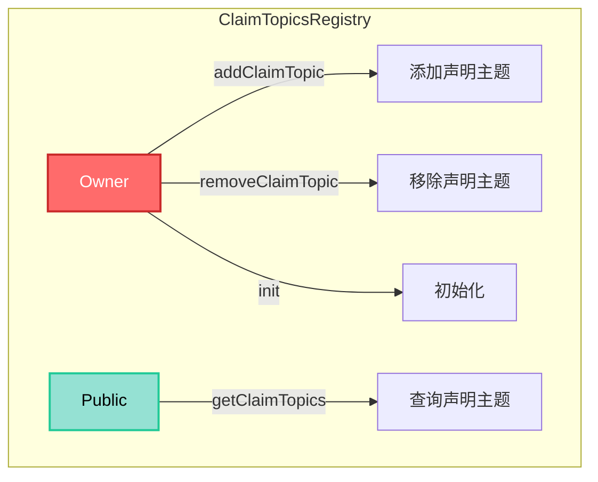

---

## 2. IdentityRegistry.sol

**继承关系：** `AgentRoleUpgradeable` + `IRStorage`

### Owner 可以做的操作

1. **`setIdentityRegistryStorage(address _identityRegistryStorage)`**
   - 设置身份注册表存储合约地址

2. **`setClaimTopicsRegistry(address _claimTopicsRegistry)`**
   - 设置声明主题注册表合约地址

3. **`setTrustedIssuersRegistry(address _trustedIssuersRegistry)`**
   - 设置可信发行者注册表合约地址

4. **`addAgent(address _agent)`** (继承自 `AgentRoleUpgradeable`)
   - 添加新的 Agent 角色

5. **`removeAgent(address _agent)`** (继承自 `AgentRoleUpgradeable`)
   - 移除 Agent 角色

6. **`init(...)`**
   - 初始化合约（仅在部署时调用一次）

### Agent 可以做的操作

1. **`batchRegisterIdentity(address[] _userAddresses, IIdentity[] _identities, uint16[] _countries)`**
   - 批量注册用户身份
   - 内部调用 `registerIdentity`

2. **`registerIdentity(address _userAddress, IIdentity _identity, uint16 _country)`**
   - 注册单个用户身份
   - 将用户地址、身份合约和国籍信息存储到 IdentityRegistryStorage

3. **`updateIdentity(address _userAddress, IIdentity _identity)`**
   - 更新用户的身份合约

4. **`updateCountry(address _userAddress, uint16 _country)`**
   - 更新用户的国籍信息

5. **`deleteIdentity(address _userAddress)`**
   - 删除用户的身份信息

### 其他角色/公开操作

以下为 view 函数，任何人都可以调用：

1. **`isVerified(address _userAddress)`** (view)
   - 检查用户是否已验证（验证身份和声明）

2. **`investorCountry(address _userAddress)`** (view)
   - 获取用户的国籍

3. **`issuersRegistry()`** (view)
   - 获取可信发行者注册表合约

4. **`topicsRegistry()`** (view)
   - 获取声明主题注册表合约

5. **`identityStorage()`** (view)
   - 获取身份注册表存储合约

6. **`contains(address _userAddress)`** (view)
   - 检查用户是否已注册

7. **`identity(address _userAddress)`** (view)
   - 获取用户的身份合约地址

### 权限结构图

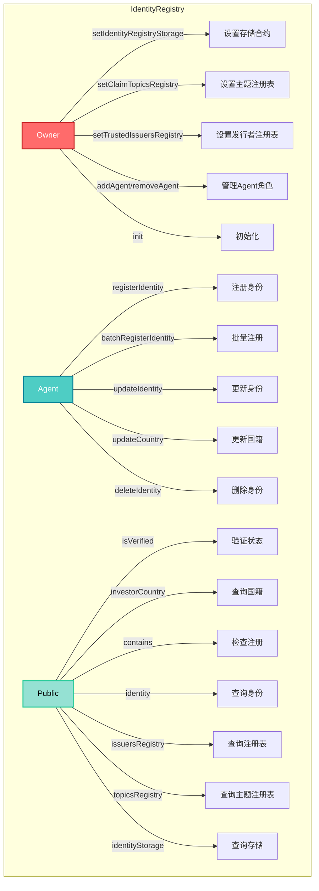

---

## 3. IdentityRegistryStorage.sol

**继承关系：** `AgentRoleUpgradeable` + `IRSStorage`

### Owner 可以做的操作

1. **`addAgent(address _agent)`** (继承自 `AgentRoleUpgradeable`)
   - 添加新的 Agent 角色

2. **`removeAgent(address _agent)`** (继承自 `AgentRoleUpgradeable`)
   - 移除 Agent 角色

3. **`init()`**
   - 初始化合约（仅在部署时调用一次）

### Agent 可以做的操作

1. **`addIdentityToStorage(address _userAddress, IIdentity _identity, uint16 _country)`**
   - 向存储中添加用户身份信息
   - 限制：用户地址不能已存在

2. **`modifyStoredIdentity(address _userAddress, IIdentity _identity)`**
   - 修改已存储的用户身份合约
   - 限制：用户地址必须已存在

3. **`modifyStoredInvestorCountry(address _userAddress, uint16 _country)`**
   - 修改已存储的用户国籍
   - 限制：用户地址必须已存在

4. **`removeIdentityFromStorage(address _userAddress)`**
   - 从存储中移除用户身份信息
   - 限制：用户地址必须已存在

### 其他角色/公开操作

1. **`bindIdentityRegistry(address _identityRegistry)`**
   - 绑定身份注册表合约
   - **注意：** 虽然函数本身没有 `onlyOwner` 修饰符，但内部调用了 `addAgent(_identityRegistry)`，而 `addAgent` 需要 owner 权限，因此实际上只有 owner 可以调用
   - 限制：最多绑定300个身份注册表

2. **`unbindIdentityRegistry(address _identityRegistry)`**
   - 解绑身份注册表合约
   - **注意：** 虽然函数本身没有 `onlyOwner` 修饰符，但内部调用了 `removeAgent(_identityRegistry)`，而 `removeAgent` 需要 owner 权限，因此实际上只有 owner 可以调用

以下为 view 函数，任何人都可以调用：

3. **`linkedIdentityRegistries()`** (view)
   - 获取所有绑定的身份注册表列表

4. **`storedIdentity(address _userAddress)`** (view)
   - 获取存储的用户身份合约

5. **`storedInvestorCountry(address _userAddress)`** (view)
   - 获取存储的用户国籍

### 权限结构图

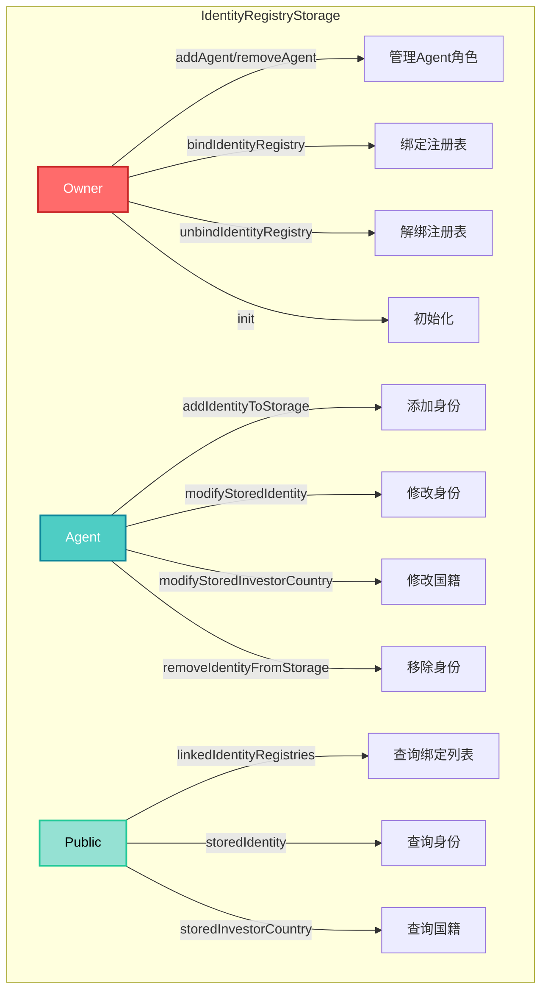

---

## 4. TrustedIssuersRegistry.sol

**继承关系：** `OwnableUpgradeable` + `TIRStorage`

### Owner 可以做的操作

1. **`addTrustedIssuer(IClaimIssuer _trustedIssuer, uint256[] _claimTopics)`**
   - 添加可信声明发行者
   - 限制：最多50个可信发行者，每个发行者最多15个声明主题

2. **`removeTrustedIssuer(IClaimIssuer _trustedIssuer)`**
   - 移除可信声明发行者

3. **`updateIssuerClaimTopics(IClaimIssuer _trustedIssuer, uint256[] _claimTopics)`**
   - 更新可信发行者的声明主题列表
   - 限制：最多15个声明主题

4. **`init()`**
   - 初始化合约（仅在部署时调用一次）

### Agent 可以做的操作

- **无**（此合约不涉及 Agent 角色）

### 其他角色/公开操作

以下为 view 函数，任何人都可以调用：

1. **`getTrustedIssuers()`** (view)
   - 获取所有可信发行者列表

2. **`getTrustedIssuersForClaimTopic(uint256 claimTopic)`** (view)
   - 获取支持特定声明主题的可信发行者列表

3. **`isTrustedIssuer(address _issuer)`** (view)
   - 检查地址是否为可信发行者

4. **`getTrustedIssuerClaimTopics(IClaimIssuer _trustedIssuer)`** (view)
   - 获取指定可信发行者的声明主题列表

5. **`hasClaimTopic(address _issuer, uint256 _claimTopic)`** (view)
   - 检查发行者是否支持指定的声明主题

### 权限结构图

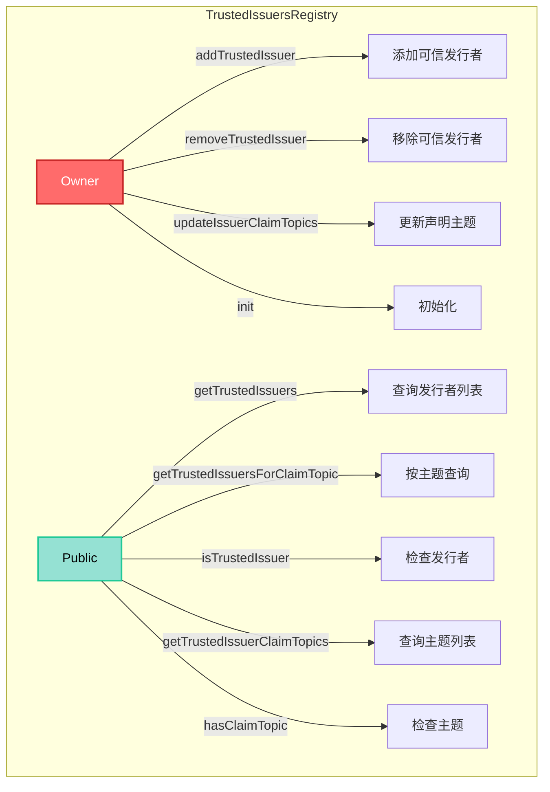

---

## 5. Token.sol

**继承关系：** `AgentRoleUpgradeable` + `TokenStorage`

### Owner 可以做的操作

1. **`setName(string calldata _name)`**
   - 设置代币名称

2. **`setSymbol(string calldata _symbol)`**
   - 设置代币符号

3. **`setOnchainID(address _onchainID)`**
   - 设置代币的 OnchainID 地址
   - 可以设置为零地址表示未绑定

4. **`setIdentityRegistry(address _identityRegistry)`**
   - 设置身份注册表合约地址

5. **`setCompliance(address _compliance)`**
   - 设置合规合约地址
   - 会自动解绑旧合规合约并绑定新合约

6. **`addAgent(address _agent)`** (继承自 `AgentRoleUpgradeable`)
   - 添加新的 Agent 角色

7. **`removeAgent(address _agent)`** (继承自 `AgentRoleUpgradeable`)
   - 移除 Agent 角色

8. **`init(...)`**
   - 初始化合约（仅在部署时调用一次）
   - 设置代币基本信息、身份注册表和合规合约

### Agent 可以做的操作

1. **`pause()`**
   - 暂停代币合约
   - 限制：合约必须未暂停

2. **`unpause()`**
   - 恢复代币合约
   - 限制：合约必须已暂停

3. **`recoveryAddress(address _lostWallet, address _newWallet, address _investorOnchainID)`**
   - 恢复丢失钱包的代币到新钱包
   - 需要新钱包的 OnchainID 验证

4. **`forcedTransfer(address _from, address _to, uint256 _amount)`**
   - 强制转账（Agent 权限）
   - 可以解冻部分代币以完成转账
   - 限制：接收地址必须已验证

5. **`mint(address _to, uint256 _amount)`**
   - 铸造代币
   - 限制：接收地址必须已验证，且通过合规检查

6. **`burn(address _userAddress, uint256 _amount)`**
   - 销毁代币
   - 可以解冻部分代币以完成销毁

7. **`setAddressFrozen(address _userAddress, bool _freeze)`**
   - 冻结/解冻地址

8. **`freezePartialTokens(address _userAddress, uint256 _amount)`**
   - 冻结用户的部分代币

9. **`unfreezePartialTokens(address _userAddress, uint256 _amount)`**
   - 解冻用户的部分代币

10. **`batchForcedTransfer(address[] _fromList, address[] _toList, uint256[] _amounts)`**
    - 批量强制转账

11. **`batchMint(address[] _toList, uint256[] _amounts)`**
    - 批量铸造代币

12. **`batchBurn(address[] _userAddresses, uint256[] _amounts)`**
    - 批量销毁代币

13. **`batchSetAddressFrozen(address[] _userAddresses, bool[] _freeze)`**
    - 批量冻结/解冻地址

14. **`batchFreezePartialTokens(address[] _userAddresses, uint256[] _amounts)`**
    - 批量冻结部分代币

15. **`batchUnfreezePartialTokens(address[] _userAddresses, uint256[] _amounts)`**
    - 批量解冻部分代币

### 其他角色/公开操作

以下为 ERC-20 标准函数和公开操作：

1. **`transfer(address _to, uint256 _amount)`**
   - 转账代币
   - 限制：合约未暂停，地址未冻结，余额充足，接收地址已验证，通过合规检查

2. **`transferFrom(address _from, address _to, uint256 _amount)`**
   - 从指定地址转账代币
   - 限制：合约未暂停，地址未冻结，余额充足，接收地址已验证，通过合规检查

3. **`approve(address _spender, uint256 _amount)`**
   - 授权支出额度

4. **`increaseAllowance(address _spender, uint256 _addedValue)`**
   - 增加授权额度

5. **`decreaseAllowance(address _spender, uint256 _subtractedValue)`**
   - 减少授权额度

6. **`batchTransfer(address[] _toList, uint256[] _amounts)`**
   - 批量转账

以下为 view 函数，任何人都可以调用：

7. **`balanceOf(address _userAddress)`** (view)
   - 查询账户余额

8. **`totalSupply()`** (view)
   - 查询代币总供应量

9. **`allowance(address _owner, address _spender)`** (view)
   - 查询授权额度

10. **`name()`** (view)
    - 查询代币名称

11. **`symbol()`** (view)
    - 查询代币符号

12. **`decimals()`** (view)
    - 查询代币精度

13. **`paused()`** (view)
    - 查询合约是否暂停

14. **`isFrozen(address _userAddress)`** (view)
    - 查询地址是否冻结

15. **`getFrozenTokens(address _userAddress)`** (view)
    - 查询冻结的代币数量

16. **`onchainID()`** (view)
    - 查询代币的 OnchainID 地址

17. **`version()`** (view)
    - 查询代币版本

18. **`identityRegistry()`** (view)
    - 查询身份注册表合约

19. **`compliance()`** (view)
    - 查询合规合约

### 权限结构图

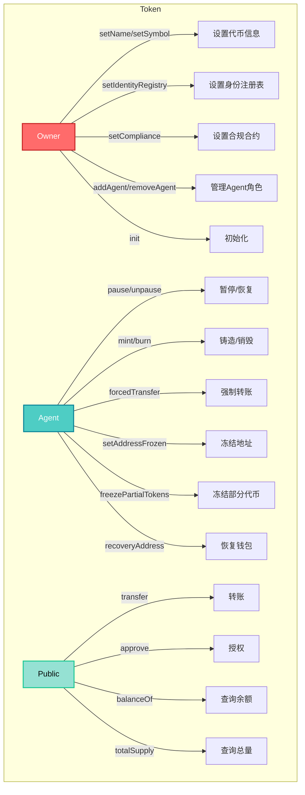

---

## 6. ModularCompliance.sol

**继承关系：** `OwnableUpgradeable` + `MCStorage`

### Owner 可以做的操作

1. **`addModule(address _module)`**
   - 添加合规模块
   - 限制：最多25个模块，模块必须未绑定，非即插即用模块需要通过兼容性检查

2. **`removeModule(address _module)`**
   - 移除合规模块
   - 限制：模块必须已绑定

3. **`callModuleFunction(bytes calldata callData, address _module)`**
   - 调用模块的自定义函数
   - 限制：模块必须已绑定
   - 用于配置模块参数

4. **`bindToken(address _token)`**
   - 绑定代币合约
   - **注意：** Owner 或代币合约本身可以调用
   - 限制：首次绑定时只能由代币合约调用

5. **`unbindToken(address _token)`**
   - 解绑代币合约
   - **注意：** Owner 或代币合约本身可以调用

6. **`init()`**
   - 初始化合约（仅在部署时调用一次）

### Token 可以做的操作（onlyToken）

以下操作只能由绑定的代币合约调用：

1. **`transferred(address _from, address _to, uint256 _value)`**
   - 代币转账后的回调
   - 触发所有模块的 `moduleTransferAction`

2. **`created(address _to, uint256 _value)`**
   - 代币铸造后的回调
   - 触发所有模块的 `moduleMintAction`

3. **`destroyed(address _from, uint256 _value)`**
   - 代币销毁后的回调
   - 触发所有模块的 `moduleBurnAction`

### 其他角色/公开操作

以下为 view 函数，任何人都可以调用：

1. **`canTransfer(address _from, address _to, uint256 _value)`** (view)
   - 检查转账是否合规
   - 会调用所有模块的 `moduleCheck` 函数

2. **`getModules()`** (view)
   - 获取所有已绑定的模块列表

3. **`isModuleBound(address _module)`** (view)
   - 检查模块是否已绑定

4. **`getTokenBound()`** (view)
   - 获取绑定的代币合约地址

### 权限结构图

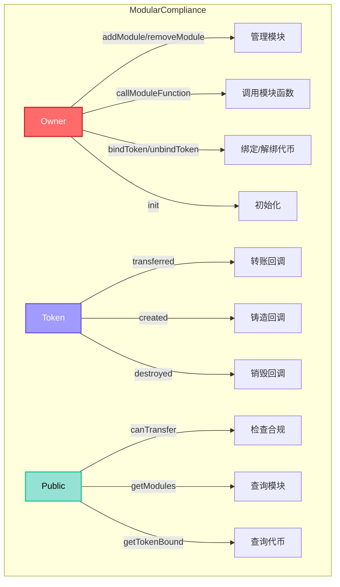

---

## 7. RWAIdentityIdFactory.sol & RWAIdentityGateway.sol

**继承关系：** 
- `RWAIdentityIdFactory` 继承自 `IdFactory` (继承自 `Ownable`)
- `RWAIdentityGateway` 继承自 `Gateway` (继承自 `Ownable`)

### RWAIdentityIdFactory - Owner 可以做的操作

1. **`addTokenFactory(address _factory)`** (继承自 `IdFactory`)
   - 添加代币工厂地址
   - 限制：地址不能为零地址，不能重复添加

2. **`removeTokenFactory(address _factory)`** (继承自 `IdFactory`)
   - 移除代币工厂地址
   - 限制：地址必须已注册为代币工厂

3. **`createIdentity(address _wallet, string memory _salt)`** (继承自 `IdFactory`)
   - 创建用户身份合约
   - 限制：钱包地址不能为零地址，salt 不能为空，salt 未被使用，钱包未链接到其他身份

4. **`createIdentityWithManagementKeys(address _wallet, string memory _salt, bytes32[] _managementKeys)`** (继承自 `IdFactory`)
   - 创建带管理密钥的用户身份合约
   - 限制：钱包地址不能为零地址，salt 不能为空，salt 未被使用，钱包未链接到其他身份，管理密钥列表不能为空，钱包地址不能出现在管理密钥中

5. **`transferOwnership(address newOwner)`** (继承自 `Ownable`)
   - 转移合约所有权

### RWAIdentityIdFactory - Token Factory 或 Owner 可以做的操作

1. **`createTokenIdentity(address _token, address _tokenOwner, string memory _salt)`** (继承自 `IdFactory`)
   - 创建代币身份合约
   - 限制：代币地址和代币所有者不能为零地址，salt 不能为空，salt 未被使用，代币未链接到其他身份

### RWAIdentityIdFactory - 其他角色/公开操作

1. **`linkWallet(address _newWallet)`** (继承自 `IdFactory`)
   - 将新钱包链接到现有身份
   - 限制：新钱包地址不能为零地址，调用者钱包必须已链接到身份，新钱包未链接，新钱包不是代币地址，每个身份最多链接100个钱包

2. **`unlinkWallet(address _oldWallet)`** (继承自 `IdFactory`)
   - 取消钱包与身份的链接
   - 限制：旧钱包地址不能为零地址，不能取消调用者自己的链接，调用者必须与旧钱包链接到同一身份

以下为 view 函数，任何人都可以调用：

3. **`getIdentity(address _wallet)`** (view, 继承自 `IdFactory`)
   - 获取钱包对应的身份合约地址

4. **`isSaltTaken(string calldata _salt)`** (view, 继承自 `IdFactory`)
   - 检查 salt 是否已被使用

5. **`getWallets(address _identity)`** (view, 继承自 `IdFactory`)
   - 获取身份合约关联的所有钱包地址列表

6. **`getToken(address _identity)`** (view, 继承自 `IdFactory`)
   - 获取身份合约关联的代币地址

7. **`isTokenFactory(address _factory)`** (view, 继承自 `IdFactory`)
   - 检查地址是否为代币工厂

8. **`implementationAuthority()`** (view, 继承自 `IdFactory`)
   - 获取实现授权合约地址

9. **`owner()`** (view, 继承自 `Ownable`)
   - 获取合约所有者地址

### RWAIdentityGateway - Owner 可以做的操作

1. **`approveSigner(address signer)`** (继承自 `Gateway`)
   - 批准签名者，允许其签名身份部署请求
   - 限制：签名者地址不能为零地址，不能重复批准

2. **`revokeSigner(address signer)`** (继承自 `Gateway`)
   - 撤销签名者权限
   - 限制：签名者地址不能为零地址，签名者必须已被批准

3. **`revokeSignature(bytes calldata signature)`** (继承自 `Gateway`)
   - 撤销签名，使该签名无法用于部署身份
   - 限制：签名必须未被撤销

4. **`approveSignature(bytes calldata signature)`** (继承自 `Gateway`)
   - 批准已撤销的签名，恢复其有效性
   - 限制：签名必须已被撤销

5. **`transferFactoryOwnership(address newOwner)`** (继承自 `Gateway`)
   - 转移工厂合约的所有权

6. **`callFactory(bytes memory data)`** (继承自 `Gateway`)
   - 调用工厂合约的任意函数
   - 限制：调用必须成功

7. **`transferOwnership(address newOwner)`** (继承自 `Ownable`)
   - 转移网关合约的所有权

### RWAIdentityGateway - 其他角色/公开操作

1. **`deployIdentityWithSalt(address identityOwner, string memory salt, uint256 signatureExpiry, bytes calldata signature)`** (继承自 `Gateway`)
   - 使用签名和自定义 salt 部署身份合约
   - 限制：身份所有者地址不能为零地址，签名未过期（如果设置了过期时间），签名来自已批准的签名者，签名未被撤销

2. **`deployIdentityWithSaltAndManagementKeys(address identityOwner, string memory salt, bytes32[] calldata managementKeys, uint256 signatureExpiry, bytes calldata signature)`** (继承自 `Gateway`)
   - 使用签名、自定义 salt 和管理密钥部署身份合约
   - 限制：身份所有者地址不能为零地址，签名未过期（如果设置了过期时间），签名来自已批准的签名者，签名未被撤销

3. **`deployIdentityForWallet(address identityOwner)`** (继承自 `Gateway`)
   - 为钱包部署身份合约（使用钱包地址作为 salt）
   - 限制：身份所有者地址不能为零地址

以下为 view 函数，任何人都可以调用：

4. **`idFactory()`** (view, 继承自 `Gateway`)
   - 获取关联的身份工厂合约地址

5. **`approvedSigners(address signer)`** (view, 继承自 `Gateway`)
   - 检查签名者是否已被批准

6. **`revokedSignatures(bytes signature)`** (view, 继承自 `Gateway`)
   - 检查签名是否已被撤销

7. **`owner()`** (view, 继承自 `Ownable`)
   - 获取合约所有者地址

### 权限结构图

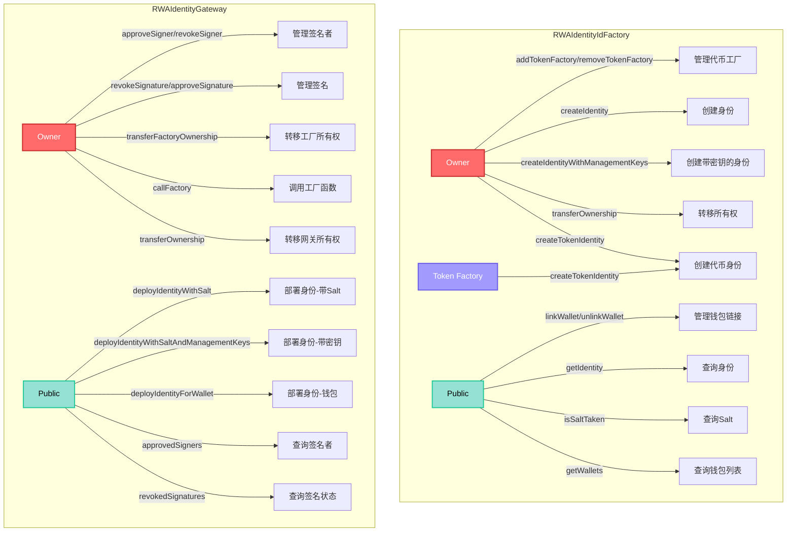

---

## 8. RWAClaimIssuerIdFactory.sol & RWAClaimIssuerGateway.sol

**继承关系：** 
- `RWAClaimIssuerIdFactory` 继承自 `IdFactory` (继承自 `Ownable`)
- `RWAClaimIssuerGateway` 继承自 `Gateway` (继承自 `Ownable`)

### RWAClaimIssuerIdFactory - Owner 可以做的操作

1. **`addTokenFactory(address _factory)`** (继承自 `IdFactory`)
   - 添加代币工厂地址
   - 限制：地址不能为零地址，不能重复添加

2. **`removeTokenFactory(address _factory)`** (继承自 `IdFactory`)
   - 移除代币工厂地址
   - 限制：地址必须已注册为代币工厂

3. **`createIdentity(address _wallet, string memory _salt)`** (继承自 `IdFactory`)
   - 创建声明发行者身份合约
   - 限制：钱包地址不能为零地址，salt 不能为空，salt 未被使用，钱包未链接到其他身份

4. **`createIdentityWithManagementKeys(address _wallet, string memory _salt, bytes32[] _managementKeys)`** (继承自 `IdFactory`)
   - 创建带管理密钥的声明发行者身份合约
   - 限制：钱包地址不能为零地址，salt 不能为空，salt 未被使用，钱包未链接到其他身份，管理密钥列表不能为空，钱包地址不能出现在管理密钥中

5. **`transferOwnership(address newOwner)`** (继承自 `Ownable`)
   - 转移合约所有权

### RWAClaimIssuerIdFactory - Token Factory 或 Owner 可以做的操作

1. **`createTokenIdentity(address _token, address _tokenOwner, string memory _salt)`** (继承自 `IdFactory`)
   - 创建代币身份合约
   - 限制：代币地址和代币所有者不能为零地址，salt 不能为空，salt 未被使用，代币未链接到其他身份

### RWAClaimIssuerIdFactory - 其他角色/公开操作

1. **`linkWallet(address _newWallet)`** (继承自 `IdFactory`)
   - 将新钱包链接到现有身份
   - 限制：新钱包地址不能为零地址，调用者钱包必须已链接到身份，新钱包未链接，新钱包不是代币地址，每个身份最多链接100个钱包

2. **`unlinkWallet(address _oldWallet)`** (继承自 `IdFactory`)
   - 取消钱包与身份的链接
   - 限制：旧钱包地址不能为零地址，不能取消调用者自己的链接，调用者必须与旧钱包链接到同一身份

以下为 view 函数，任何人都可以调用：

3. **`getIdentity(address _wallet)`** (view, 继承自 `IdFactory`)
   - 获取钱包对应的身份合约地址

4. **`isSaltTaken(string calldata _salt)`** (view, 继承自 `IdFactory`)
   - 检查 salt 是否已被使用

5. **`getWallets(address _identity)`** (view, 继承自 `IdFactory`)
   - 获取身份合约关联的所有钱包地址列表

6. **`getToken(address _identity)`** (view, 继承自 `IdFactory`)
   - 获取身份合约关联的代币地址

7. **`isTokenFactory(address _factory)`** (view, 继承自 `IdFactory`)
   - 检查地址是否为代币工厂

8. **`implementationAuthority()`** (view, 继承自 `IdFactory`)
   - 获取实现授权合约地址

9. **`owner()`** (view, 继承自 `Ownable`)
   - 获取合约所有者地址

### RWAClaimIssuerGateway - Owner 可以做的操作

1. **`approveSigner(address signer)`** (继承自 `Gateway`)
   - 批准签名者，允许其签名身份部署请求
   - 限制：签名者地址不能为零地址，不能重复批准

2. **`revokeSigner(address signer)`** (继承自 `Gateway`)
   - 撤销签名者权限
   - 限制：签名者地址不能为零地址，签名者必须已被批准

3. **`revokeSignature(bytes calldata signature)`** (继承自 `Gateway`)
   - 撤销签名，使该签名无法用于部署身份
   - 限制：签名必须未被撤销

4. **`approveSignature(bytes calldata signature)`** (继承自 `Gateway`)
   - 批准已撤销的签名，恢复其有效性
   - 限制：签名必须已被撤销

5. **`transferFactoryOwnership(address newOwner)`** (继承自 `Gateway`)
   - 转移工厂合约的所有权

6. **`callFactory(bytes memory data)`** (继承自 `Gateway`)
   - 调用工厂合约的任意函数
   - 限制：调用必须成功

7. **`transferOwnership(address newOwner)`** (继承自 `Ownable`)
   - 转移网关合约的所有权

### RWAClaimIssuerGateway - 其他角色/公开操作

1. **`deployIdentityWithSalt(address identityOwner, string memory salt, uint256 signatureExpiry, bytes calldata signature)`** (继承自 `Gateway`)
   - 使用签名和自定义 salt 部署声明发行者身份合约
   - 限制：身份所有者地址不能为零地址，签名未过期（如果设置了过期时间），签名来自已批准的签名者，签名未被撤销

2. **`deployIdentityWithSaltAndManagementKeys(address identityOwner, string memory salt, bytes32[] calldata managementKeys, uint256 signatureExpiry, bytes calldata signature)`** (继承自 `Gateway`)
   - 使用签名、自定义 salt 和管理密钥部署声明发行者身份合约
   - 限制：身份所有者地址不能为零地址，签名未过期（如果设置了过期时间），签名来自已批准的签名者，签名未被撤销

3. **`deployIdentityForWallet(address identityOwner)`** (继承自 `Gateway`)
   - 为钱包部署声明发行者身份合约（使用钱包地址作为 salt）
   - 限制：身份所有者地址不能为零地址

以下为 view 函数，任何人都可以调用：

4. **`idFactory()`** (view, 继承自 `Gateway`)
   - 获取关联的身份工厂合约地址

5. **`approvedSigners(address signer)`** (view, 继承自 `Gateway`)
   - 检查签名者是否已被批准

6. **`revokedSignatures(bytes signature)`** (view, 继承自 `Gateway`)
   - 检查签名是否已被撤销

7. **`owner()`** (view, 继承自 `Ownable`)
   - 获取合约所有者地址

### 权限结构图

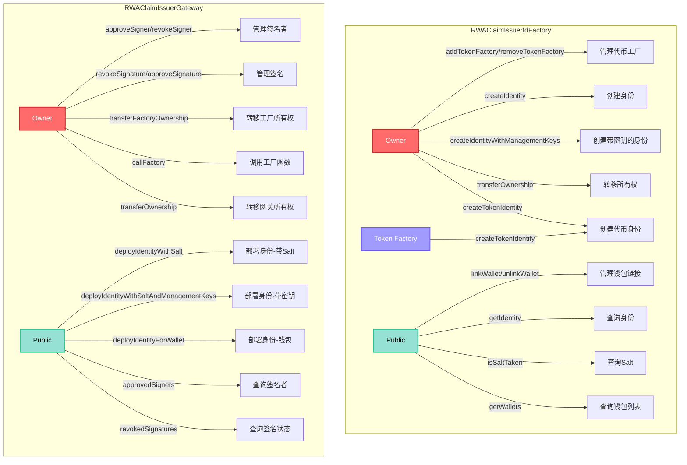

---

## 9. TREXFactory.sol

**继承关系：** `ITREXFactory` + `Ownable`

### Owner 可以做的操作

1. **`deployTREXSuite(string memory _salt, TokenDetails calldata _tokenDetails, ClaimDetails calldata _claimDetails)`**
   - 部署完整的 TREX 套件（Token、IdentityRegistry、IdentityRegistryStorage、TrustedIssuersRegistry、ClaimTopicsRegistry、ModularCompliance）
   - 限制：
     - salt 必须未被使用
     - 发行者数量必须等于发行者声明数量
     - 最多5个声明发行者
     - 最多5个声明主题
     - 最多5个 IR Agent 和 5个 Token Agent
     - 最多30个合规模块操作
     - 合规模块数量必须大于等于合规设置数量
   - 功能：
     - 使用 CREATE2 部署所有相关合约
     - 配置声明主题和可信发行者
     - 绑定身份注册表存储
     - 添加 Agent 角色
     - 配置合规模块
     - 将所有合约的所有权转移给代币所有者
     - 如果未提供 OnchainID，会自动创建代币身份

2. **`recoverContractOwnership(address _contract, address _newOwner)`**
   - 恢复指定合约的所有权
   - 用于恢复因各种原因丢失所有权的合约

3. **`setImplementationAuthority(address implementationAuthority_)`**
   - 设置实现授权合约地址
   - 限制：地址不能为零地址，实现授权必须包含所有必需的实现地址（Token、CTR、IR、IRS、MC、TIR）

4. **`setIdFactory(address idFactory_)`**
   - 设置身份工厂合约地址
   - 限制：地址不能为零地址

### 其他角色/公开操作

以下为 view 函数，任何人都可以调用：

1. **`getImplementationAuthority()`** (view)
   - 获取实现授权合约地址

2. **`getIdFactory()`** (view)
   - 获取身份工厂合约地址

3. **`getToken(string calldata _salt)`** (view)
   - 根据 salt 获取已部署的代币合约地址

4. **`tokenDeployed(string)`** (public mapping)
   - 公开映射，查询指定 salt 对应的已部署代币地址

### 权限结构图

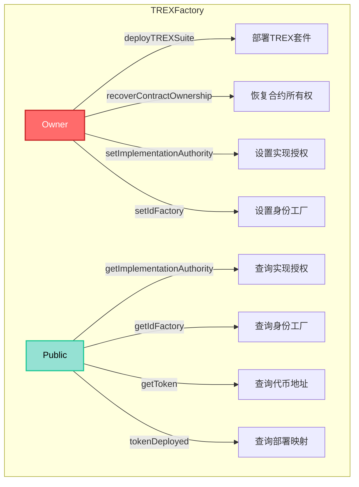

---

## 10. TREXImplementationAuthority.sol

**继承关系：** `ITREXImplementationAuthority` + `Ownable`

### Owner 可以做的操作

1. **`setTREXFactory(address trexFactory)`**
   - 设置 TREXFactory 合约地址
   - 限制：仅限 reference contract 可以调用，且 TREXFactory 必须引用当前合约

2. **`setIAFactory(address iaFactory)`**
   - 设置 IA Factory 合约地址
   - 限制：仅限 reference contract 可以调用，且 TREXFactory 必须引用当前合约

3. **`addTREXVersion(Version calldata _version, TREXContracts calldata _trex)`**
   - 添加新的 TREX 版本及其合约实现地址
   - 限制：仅限 reference contract 可以调用，版本不能已存在，所有合约实现地址不能为零地址

4. **`useTREXVersion(Version calldata _version)`**
   - 切换到指定的 TREX 版本
   - 限制：版本必须已添加，不能是当前使用的版本

5. **`transferOwnership(address newOwner)`** (继承自 `Ownable`)
   - 转移合约所有权

### 其他角色/公开操作

1. **`addAndUseTREXVersion(Version calldata _version, TREXContracts calldata _trex)`**
   - 添加 TREX 版本并立即使用
   - 内部调用 `addTREXVersion` 和 `useTREXVersion`（需要 owner 权限）

2. **`fetchVersion(Version calldata _version)`**
   - 从 reference contract 获取指定版本
   - 限制：仅限非 reference contract 可以调用，版本不能已获取

3. **`changeImplementationAuthority(address _token, address _newImplementationAuthority)`**
   - 更改代币及其相关合约的实现授权
   - 限制：调用者必须是以下所有合约的 owner：
     - Token 合约
     - IdentityRegistry 合约
     - ModularCompliance 合约
     - IdentityRegistryStorage 合约
     - ClaimTopicsRegistry 合约
     - TrustedIssuersRegistry 合约
   - 如果 `_newImplementationAuthority` 为零地址，将自动部署新的 IA
   - 新 IA 的版本必须与当前 IA 版本相同

以下为 view 函数，任何人都可以调用：

4. **`getCurrentVersion()`** (view)
   - 获取当前使用的 TREX 版本

5. **`getContracts(Version calldata _version)`** (view)
   - 获取指定版本的合约实现地址

6. **`getTREXFactory()`** (view)
   - 获取 TREXFactory 合约地址

7. **`getTokenImplementation()`** (view)
   - 获取当前版本的代币实现地址

8. **`getCTRImplementation()`** (view)
   - 获取当前版本的 ClaimTopicsRegistry 实现地址

9. **`getIRImplementation()`** (view)
   - 获取当前版本的 IdentityRegistry 实现地址

10. **`getIRSImplementation()`** (view)
    - 获取当前版本的 IdentityRegistryStorage 实现地址

11. **`getTIRImplementation()`** (view)
    - 获取当前版本的 TrustedIssuersRegistry 实现地址

12. **`getMCImplementation()`** (view)
    - 获取当前版本的 ModularCompliance 实现地址

13. **`isReferenceContract()`** (view)
    - 检查当前合约是否为 reference contract

14. **`getReferenceContract()`** (view)
    - 获取 reference contract 地址

### 权限结构图

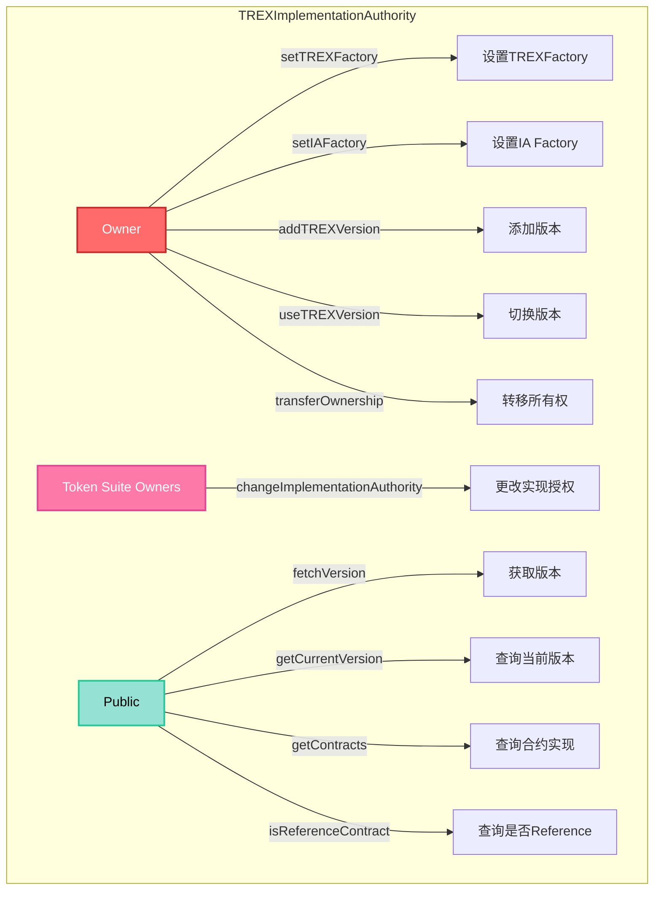

---

## 11. TREXGateway.sol

**继承关系：** `ITREXGateway` + `AgentRole`

### Owner 可以做的操作

1. **`setFactory(address factory)`**
   - 设置 TREXFactory 合约地址
   - 限制：地址不能为零地址

2. **`setPublicDeploymentStatus(bool _isEnabled)`**
   - 设置公开部署状态
   - 限制：不能设置为当前已设置的状态

3. **`transferFactoryOwnership(address _newOwner)`**
   - 转移 TREXFactory 合约的所有权

4. **`enableDeploymentFee(bool _isEnabled)`**
   - 启用或禁用部署费用
   - 限制：不能设置为当前已设置的状态

5. **`setDeploymentFee(uint256 _fee, address _feeToken, address _feeCollector)`**
   - 设置部署费用详情（费用金额、费用代币、费用收集地址）
   - 限制：费用代币和费用收集地址不能为零地址

6. **`addAgent(address _agent)`** (继承自 `AgentRole`)
   - 添加新的 Agent 角色

7. **`removeAgent(address _agent)`** (继承自 `AgentRole`)
   - 移除 Agent 角色

### Owner 或 Agent 可以做的操作

1. **`batchAddDeployer(address[] calldata deployers)`**
   - 批量添加部署者
   - 限制：批量大小不能超过500，部署者不能已存在

2. **`addDeployer(address deployer)`**
   - 添加单个部署者
   - 限制：部署者不能已存在

3. **`batchRemoveDeployer(address[] calldata deployers)`**
   - 批量移除部署者
   - 限制：批量大小不能超过500，部署者必须已存在

4. **`removeDeployer(address deployer)`**
   - 移除单个部署者
   - 限制：部署者必须已存在

5. **`batchApplyFeeDiscount(address[] calldata deployers, uint16[] calldata discounts)`**
   - 批量应用费用折扣
   - 限制：批量大小不能超过500，折扣不能超过10000（100%）

6. **`applyFeeDiscount(address deployer, uint16 discount)`**
   - 为部署者应用费用折扣
   - 限制：折扣不能超过10000（100%）

### Deployer 或 Public 可以做的操作

1. **`deployTREXSuite(ITREXFactory.TokenDetails memory _tokenDetails, ITREXFactory.ClaimDetails memory _claimDetails)`**
   - 部署 TREX 套件
   - 限制：
     - 如果公开部署被禁用，只有部署者可以调用
     - 如果公开部署被启用，调用者必须是代币所有者或部署者
     - 如果启用了部署费用，需要支付相应费用（根据折扣计算）

2. **`batchDeployTREXSuite(ITREXFactory.TokenDetails[] memory _tokenDetails, ITREXFactory.ClaimDetails[] memory _claimDetails)`**
   - 批量部署 TREX 套件
   - 限制：批量大小不能超过5

### 其他角色/公开操作

以下为 view 函数，任何人都可以调用：

1. **`getPublicDeploymentStatus()`** (view)
   - 获取公开部署状态

2. **`getFactory()`** (view)
   - 获取 TREXFactory 合约地址

3. **`getDeploymentFee()`** (view)
   - 获取部署费用详情

4. **`isDeploymentFeeEnabled()`** (view)
   - 检查部署费用是否已启用

5. **`isDeployer(address deployer)`** (view)
   - 检查地址是否为部署者

6. **`calculateFee(address deployer)`** (view)
   - 计算部署者需要支付的费用（考虑折扣）

### 权限结构图

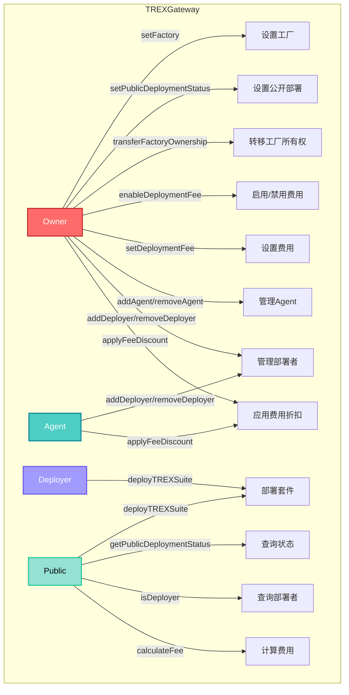

---

## 12. Identity.sol

**继承关系：** `Storage` + `IIdentity` + `Version`

**说明：** 这是一个基于密钥的身份合约，实现了 ERC-734（KeyHolder）和 ERC-735（ClaimHolder）标准。权限基于密钥的目的（Purpose）进行管理。

### Management Key (Purpose 1) 可以做的操作

1. **`addKey(bytes32 _key, uint256 _purpose, uint256 _type)`**
   - 添加密钥到身份合约
   - 限制：密钥不能已具有相同目的，只能由管理密钥或身份合约本身调用

2. **`removeKey(bytes32 _key, uint256 _purpose)`**
   - 移除密钥的指定目的
   - 限制：密钥必须已存在且具有该目的

3. **`approve(uint256 _id, bool _approve)`**
   - 批准或拒绝执行请求
   - 限制：当目标地址是身份合约本身时，需要管理密钥权限

4. **`execute(address _to, uint256 _value, bytes memory _data)`**
   - 执行操作请求
   - 限制：如果目标地址是身份合约本身，管理密钥可以立即批准并执行

### Action Key (Purpose 2) 可以做的操作

1. **`execute(address _to, uint256 _value, bytes memory _data)`**
   - 执行操作请求
   - 限制：如果目标地址不是身份合约本身，操作密钥可以立即批准并执行

2. **`approve(uint256 _id, bool _approve)`**
   - 批准或拒绝执行请求
   - 限制：当目标地址不是身份合约本身时，需要操作密钥权限

### Claim Key (Purpose 3) 可以做的操作

1. **`addClaim(uint256 _topic, uint256 _scheme, address _issuer, bytes memory _signature, bytes memory _data, string memory _uri)`**
   - 添加声明到身份合约
   - 限制：需要声明签名密钥权限，如果发行者不是身份合约本身，需要验证声明有效性

2. **`removeClaim(bytes32 _claimId)`**
   - 移除声明
   - 限制：需要声明签名密钥权限

### 其他角色/公开操作

以下为 view 函数，任何人都可以调用：

1. **`getKey(bytes32 _key)`** (view)
   - 获取密钥的完整信息（目的、类型、密钥值）

2. **`getKeyPurposes(bytes32 _key)`** (view)
   - 获取密钥的所有目的

3. **`getKeysByPurpose(uint256 _purpose)`** (view)
   - 获取具有指定目的的所有密钥

4. **`getClaimIdsByTopic(uint256 _topic)`** (view)
   - 获取指定主题的所有声明 ID

5. **`getClaim(bytes32 _claimId)`** (view)
   - 获取声明的完整信息

6. **`keyHasPurpose(bytes32 _key, uint256 _purpose)`** (view)
   - 检查密钥是否具有指定目的（管理密钥具有所有目的）

7. **`isClaimValid(IIdentity _identity, uint256 claimTopic, bytes memory sig, bytes memory data)`** (view)
   - 检查声明是否有效
   - 验证签名是否来自具有声明签名密钥的地址

8. **`getRecoveredAddress(bytes memory sig, bytes32 dataHash)`** (view)
   - 从签名中恢复地址

9. **`initialize(address initialManagementKey)`**
   - 初始化身份合约（仅在代理部署时调用）
   - 限制：只能调用一次，初始管理密钥不能为零地址

### 密钥目的说明

- **Purpose 1 (MANAGEMENT)**：管理密钥，可以管理身份合约（添加/移除密钥、批准执行等）
- **Purpose 2 (ACTION)**：操作密钥，可以执行操作（转账、调用合约等）
- **Purpose 3 (CLAIM)**：声明签名密钥，可以添加和移除声明
- **Purpose 4 (ENCRYPTION)**：加密密钥，用于加密数据（目前主要用于存储）

### 权限结构图

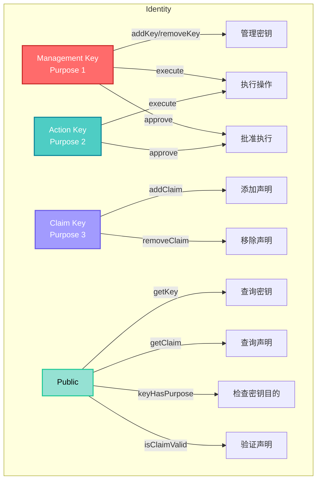

---

## 13. ClaimIssuer.sol

**继承关系：** `IClaimIssuer` + `Identity`

**说明：** `ClaimIssuer` 继承自 `Identity` 合约，是一个专门用于发行和撤销声明的身份合约。它继承了 `Identity` 的所有功能（密钥管理、声明管理等），并添加了声明撤销功能。

### Management Key (Purpose 1) 可以做的操作

继承自 `Identity` 的所有 Management Key 权限，包括：

1. **`addKey(bytes32 _key, uint256 _purpose, uint256 _type)`** (继承自 `Identity`)
   - 添加密钥到身份合约

2. **`removeKey(bytes32 _key, uint256 _purpose)`** (继承自 `Identity`)
   - 移除密钥的指定目的

3. **`execute(address _to, uint256 _value, bytes memory _data)`** (继承自 `Identity`)
   - 执行操作请求

4. **`approve(uint256 _id, bool _approve)`** (继承自 `Identity`)
   - 批准或拒绝执行请求

5. **`revokeClaimBySignature(bytes calldata signature)`**
   - 通过签名撤销声明
   - 限制：需要 `delegatedOnly` 和 `onlyManager` 权限（即需要 Management Key）
   - 限制：声明必须未被撤销

6. **`revokeClaim(bytes32 _claimId, address _identity)`**
   - 通过声明 ID 撤销指定身份合约中的声明
   - 限制：需要 `delegatedOnly` 和 `onlyManager` 权限（即需要 Management Key）
   - 限制：声明必须未被撤销
   - 功能：从指定身份合约获取声明信息，然后撤销该声明

### Action Key (Purpose 2) 可以做的操作

继承自 `Identity` 的所有 Action Key 权限，包括：

1. **`execute(address _to, uint256 _value, bytes memory _data)`** (继承自 `Identity`)
   - 执行操作请求

2. **`approve(uint256 _id, bool _approve)`** (继承自 `Identity`)
   - 批准或拒绝执行请求

### Claim Key (Purpose 3) 可以做的操作

继承自 `Identity` 的所有 Claim Key 权限，包括：

1. **`addClaim(uint256 _topic, uint256 _scheme, address _issuer, bytes memory _signature, bytes memory _data, string memory _uri)`** (继承自 `Identity`)
   - 添加声明到身份合约

2. **`removeClaim(bytes32 _claimId)`** (继承自 `Identity`)
   - 移除声明

### 其他角色/公开操作

以下为 view 函数，任何人都可以调用：

1. **`isClaimValid(IIdentity _identity, uint256 claimTopic, bytes memory sig, bytes memory data)`** (view, 覆盖 `Identity` 实现)
   - 检查声明是否有效
   - 验证逻辑：
     - 计算声明的数据哈希
     - 从签名中恢复签名者地址
     - 检查签名者是否具有 Claim Key (Purpose 3)
     - 检查声明是否已被撤销
   - 返回：如果签名者具有 Claim Key 且声明未被撤销，返回 true

2. **`isClaimRevoked(bytes memory _sig)`** (view)
   - 检查指定签名的声明是否已被撤销
   - 返回：如果声明已被撤销，返回 true

3. **`revokedClaims(bytes)`** (public mapping)
   - 公开映射，查询指定签名对应的声明是否已被撤销

继承自 `Identity` 的所有其他 view 函数，包括：

4. **`getKey(bytes32 _key)`** (view, 继承自 `Identity`)
   - 获取密钥的完整信息

5. **`getKeyPurposes(bytes32 _key)`** (view, 继承自 `Identity`)
   - 获取密钥的所有目的

6. **`getKeysByPurpose(uint256 _purpose)`** (view, 继承自 `Identity`)
   - 获取具有指定目的的所有密钥

7. **`getClaimIdsByTopic(uint256 _topic)`** (view, 继承自 `Identity`)
   - 获取指定主题的所有声明 ID

8. **`getClaim(bytes32 _claimId)`** (view, 继承自 `Identity`)
   - 获取声明的完整信息

9. **`keyHasPurpose(bytes32 _key, uint256 _purpose)`** (view, 继承自 `Identity`)
   - 检查密钥是否具有指定目的

10. **`getRecoveredAddress(bytes memory sig, bytes32 dataHash)`** (view, 继承自 `Identity`)
    - 从签名中恢复地址

### 权限结构图

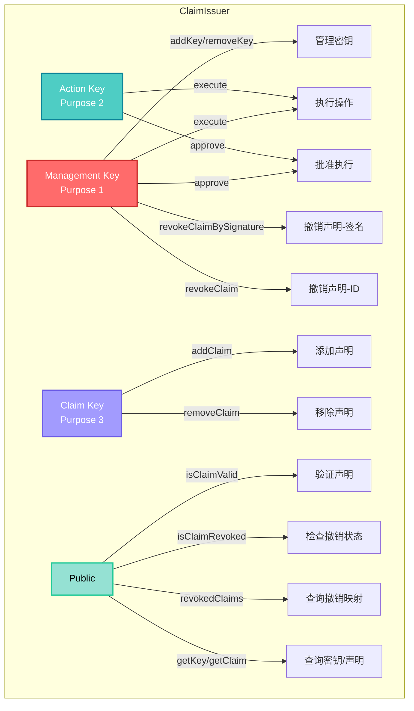

---

## 权限关系总结

### 角色层级

```
Owner (最高权限)
  ├── 管理合约配置
  ├── 管理 Agent 角色
  ├── 管理注册表核心设置
  ├── 管理身份工厂和网关
  ├── 管理签名者和签名
  ├── 部署 TREX 套件（TREXFactory）
  ├── 管理 TREX 版本和实现授权
  └── 管理 TREX Gateway 配置和部署者

Agent (操作权限)
  ├── 管理用户身份注册
  ├── 管理身份信息更新
  ├── 管理身份存储操作
  └── 管理 TREX Gateway 部署者和费用折扣

Deployer (部署者权限)
  └── 部署 TREX 套件（即使公开部署被禁用）

Token Factory (代币工厂权限)
  └── 创建代币身份合约

Token Suite Owners (代币套件所有者)
  └── 更改代币及其相关合约的实现授权

Management Key (身份管理密钥)
  ├── 管理身份合约的密钥
  ├── 批准和执行操作
  └── 撤销声明（ClaimIssuer）

Action Key (身份操作密钥)
  └── 执行操作和批准执行

Claim Key (身份声明密钥)
  └── 添加和移除声明

Public (公开权限)
  ├── 查询合约状态和信息
  ├── 部署身份合约（需有效签名）
  ├── 管理钱包与身份的链接
  ├── 从 reference contract 获取版本
  └── 部署 TREX 套件（如果公开部署被启用）
```

### 关键权限说明

1. **Owner 权限范围：**
   - 所有合约的配置管理
   - Agent 角色的添加和移除
   - 注册表之间的关联设置
   - 代币基本信息和关联合约配置
   - 合规模块的添加、移除和配置
   - 身份工厂的代币工厂管理
   - 身份工厂的身份创建
   - 网关的签名者管理和签名管理
   - TREX 版本的添加和切换
   - TREXFactory 的配置（实现授权、身份工厂设置）
   - TREXFactory 的 TREX 套件部署
   - TREXFactory 的合约所有权恢复
   - TREXImplementationAuthority 和 IA Factory 的设置
   - TREX Gateway 的配置和工厂所有权管理

2. **Agent 权限范围：**
   - 用户身份的日常管理操作
   - 身份信息的增删改查
   - 代币的铸造、销毁、冻结等操作
   - TREX Gateway 的部署者管理和费用折扣设置
   - 不涉及系统配置变更

3. **Deployer 权限范围：**
   - 部署 TREX 套件（即使公开部署被禁用）
   - 可以享受费用折扣（如果已设置）

4. **Token 权限（仅限绑定的代币合约）：**
   - 调用合规合约的转账、铸造、销毁回调
   - 用于触发合规模块的状态更新

5. **Token Factory 权限（仅限已注册的代币工厂）：**
   - 创建代币身份合约
   - 用于将代币与身份合约关联

6. **Token Suite Owners 权限（需要拥有所有相关合约的所有权）：**
   - 更改代币及其相关合约的实现授权
   - 用于升级或迁移代币套件的实现

7. **Identity 密钥权限：**
   - **Management Key (Purpose 1)**：管理身份合约的密钥，批准和执行操作
   - **Action Key (Purpose 2)**：执行操作和批准执行（当目标不是身份合约本身时）
   - **Claim Key (Purpose 3)**：添加和移除声明
   - 密钥可以具有多个目的，管理密钥具有所有目的的权限

8. **ClaimIssuer 权限：**
   - 继承 `Identity` 的所有权限
   - **Management Key** 可以撤销声明（通过签名或声明 ID）
   - 覆盖 `isClaimValid` 函数，增加了声明撤销状态的检查
   - 用于作为可信声明发行者，可以发行和撤销声明

9. **公开权限：**
   - 所有 view 函数均可公开访问
   - ERC-20 标准的转账和授权操作
   - 身份工厂的钱包链接/取消链接操作
   - 网关的身份部署操作（需要有效签名）
   - 从 reference contract 获取版本（仅限非 reference contract）
   - 部署 TREX 套件（如果公开部署被启用，且调用者是代币所有者）
   - 用于查询和验证，不影响状态（转账和部署除外）

### 权限矩阵图

```mermaid
graph LR
    subgraph "权限角色"
        Owner[Owner<br/>所有者]
        Agent[Agent<br/>代理]
        Public[Public<br/>公开]
        TokenFactory[Token Factory<br/>代币工厂]
        TokenOwners[Token Suite Owners<br/>代币套件所有者]
        Deployer[Deployer<br/>部署者]
        MgmtKey[Management Key<br/>管理密钥]
        ActionKey[Action Key<br/>操作密钥]
        ClaimKey[Claim Key<br/>声明密钥]
    end
    
    subgraph "合约功能"
        CTR[ClaimTopicsRegistry]
        IR[IdentityRegistry]
        IRS[IdentityRegistryStorage]
        TIR[TrustedIssuersRegistry]
        Token[Token]
        MC[ModularCompliance]
        IF[IdentityIdFactory]
        IG[IdentityGateway]
        CIF[ClaimIssuerIdFactory]
        CIG[ClaimIssuerGateway]
        TF[TREXFactory]
        IA[TREXImplementationAuthority]
        TG[TREXGateway]
        ID[Identity]
        CI[ClaimIssuer]
    end
    
    Owner -->|配置管理| CTR
    Owner -->|配置管理<br/>Agent管理| IR
    Owner -->|Agent管理<br/>绑定管理| IRS
    Owner -->|发行者管理| TIR
    Owner -->|代币配置<br/>Agent管理| Token
    Owner -->|模块管理<br/>代币绑定| MC
    Owner -->|身份工厂管理| IF
    Owner -->|签名者管理| IG
    Owner -->|声明发行者工厂管理| CIF
    Owner -->|签名者管理| CIG
    Owner -->|部署套件<br/>配置管理| TF
    Owner -->|版本管理<br/>工厂设置| IA
    Owner -->|配置管理<br/>工厂所有权| TG
    
    Agent -.->|无权限| CTR
    Agent -->|身份管理| IR
    Agent -->|存储管理| IRS
    Agent -.->|无权限| TIR
    Agent -->|代币操作<br/>冻结管理| Token
    Agent -->|部署者管理<br/>费用折扣| TG
    Agent -.->|无权限| MC
    Agent -.->|无权限| IF
    Agent -.->|无权限| IG
    Agent -.->|无权限| CIF
    Agent -.->|无权限| CIG
    
    Public -->|查询| CTR
    Public -->|查询| IR
    Public -->|查询| IRS
    Public -->|查询| TIR
    Public -->|转账<br/>查询| Token
    Public -->|查询| MC
    Public -->|部署身份<br/>查询| IF
    Public -->|部署身份<br/>查询| IG
    Public -->|部署身份<br/>查询| CIF
    Public -->|部署身份<br/>查询| CIG
    Public -->|获取版本<br/>查询| IA
    Public -->|部署套件<br/>查询| TG
    Public -->|查询| TF
    Public -->|查询密钥<br/>查询声明| ID
    Public -->|验证声明<br/>查询| CI
    
    Deployer -->|部署套件| TG
    
    TokenFactory -->|创建代币身份| IF
    TokenFactory -->|创建代币身份| CIF
    
    TokenOwners -->|更改实现授权| IA
    
    MgmtKey -->|管理密钥<br/>执行操作<br/>撤销声明| ID
    MgmtKey -->|撤销声明| CI
    ActionKey -->|执行操作| ID
    ActionKey -->|执行操作| CI
    ClaimKey -->|管理声明| ID
    ClaimKey -->|管理声明| CI
    
    Token -.->|回调| MC
    
    classDef ownerStyle fill:#ff6b6b,stroke:#c92a2a,stroke-width:3px,color:#fff
    classDef agentStyle fill:#4ecdc4,stroke:#0c8599,stroke-width:3px,color:#fff
    classDef publicStyle fill:#95e1d3,stroke:#20c997,stroke-width:3px,color:#000
    classDef contractStyle fill:#ffeaa7,stroke:#fdcb6e,stroke-width:2px,color:#000
    classDef tokenStyle fill:#a29bfe,stroke:#6c5ce7,stroke-width:2px,color:#fff
    classDef tokenFactoryStyle fill:#fd79a8,stroke:#e84393,stroke-width:2px,color:#fff
    classDef tokenOwnersStyle fill:#fdcb6e,stroke:#e17055,stroke-width:2px,color:#000
    classDef deployerStyle fill:#a29bfe,stroke:#6c5ce7,stroke-width:2px,color:#fff
    classDef mgmtKeyStyle fill:#ff6b6b,stroke:#c92a2a,stroke-width:2px,color:#fff
    classDef actionKeyStyle fill:#4ecdc4,stroke:#0c8599,stroke-width:2px,color:#fff
    classDef claimKeyStyle fill:#a29bfe,stroke:#6c5ce7,stroke-width:2px,color:#fff
    
    class Owner ownerStyle
    class Agent agentStyle
    class Public publicStyle
    class TokenFactory tokenFactoryStyle
    class TokenOwners tokenOwnersStyle
    class Deployer deployerStyle
    class MgmtKey mgmtKeyStyle
    class ActionKey actionKeyStyle
    class ClaimKey claimKeyStyle
    class CTR,IR,IRS,TIR,Token,MC,IF,IG,CIF,CIG,TF,IA,TG,ID,CI contractStyle
```

### 注意事项

1. `IdentityRegistryStorage.bindIdentityRegistry()` 和 `unbindIdentityRegistry()` 虽然没有显式的 `onlyOwner` 修饰符，但由于内部调用了需要 owner 权限的 `addAgent`/`removeAgent`，因此实际上只有 owner 可以调用。

2. Agent 角色由 Owner 通过 `addAgent()` 和 `removeAgent()` 管理，这些函数继承自 `AgentRoleUpgradeable`。

3. 所有合约都使用 `initializer` 修饰符保护初始化函数，确保只能调用一次。

4. `ModularCompliance.bindToken()` 和 `unbindToken()` 可以由 Owner 或代币合约本身调用。首次绑定时，如果 `_tokenBound` 为零地址，只能由代币合约调用。

5. `ModularCompliance` 的 `transferred`、`created`、`destroyed` 函数只能由绑定的代币合约通过 `onlyToken` 修饰符调用，用于在代币操作后触发合规模块的状态更新。

6. `Token` 合约的 `transfer` 和 `transferFrom` 函数需要满足以下条件：
   - 合约未暂停（`whenNotPaused`）
   - 地址未冻结
   - 余额充足（考虑冻结代币）
   - 接收地址已验证（`isVerified`）
   - 通过合规检查（`canTransfer`）

7. `Token` 合约的 `mint` 函数需要接收地址已验证且通过合规检查（`canTransfer` 从零地址到接收地址）。

8. `IdFactory` 合约的 `createTokenIdentity` 函数可以由 Owner 或已注册的 Token Factory 调用，用于创建代币身份合约。

9. `Gateway` 合约的 `deployIdentityWithSalt` 和 `deployIdentityWithSaltAndManagementKeys` 函数需要有效的签名，签名必须来自已批准的签名者且未被撤销。如果设置了过期时间，签名必须在有效期内。

10. `Gateway` 合约在构造函数中最多可以批准10个签名者，后续可以通过 `approveSigner` 添加更多签名者。

11. `IdFactory` 合约中，每个身份最多可以链接100个钱包地址，通过 `linkWallet` 和 `unlinkWallet` 进行管理。

12. `TREXImplementationAuthority` 合约分为 reference contract 和 auxiliary contract 两种类型。只有 reference contract 可以添加版本、设置工厂等操作。Auxiliary contract 可以从 reference contract 获取版本。

13. `TREXImplementationAuthority.changeImplementationAuthority()` 函数要求调用者必须是 Token、IdentityRegistry、ModularCompliance、IdentityRegistryStorage、ClaimTopicsRegistry 和 TrustedIssuersRegistry 这六个合约的所有者，用于统一升级整个代币套件的实现授权。

14. `TREXImplementationAuthority` 的 `setTREXFactory` 和 `setIAFactory` 函数只能在 reference contract 上调用，且需要验证 TREXFactory 确实引用了当前合约。

15. `TREXGateway` 的 `deployTREXSuite` 函数有特殊的权限控制：
    - 如果公开部署被禁用，只有部署者可以调用
    - 如果公开部署被启用，调用者必须是代币所有者（`_tokenDetails.owner`）或部署者
    - 如果启用了部署费用，需要支付相应费用（根据部署者的折扣计算）

16. `TREXGateway` 的批量操作有大小限制：
    - `batchAddDeployer`、`batchRemoveDeployer`、`batchApplyFeeDiscount` 最多500个
    - `batchDeployTREXSuite` 最多5个

17. `Identity` 合约使用基于密钥的权限系统，密钥可以有多个目的（Purpose）：
    - Management Key (Purpose 1) 具有所有目的的权限
    - 密钥通过 `keccak256(abi.encode(address))` 的方式存储
    - `keyHasPurpose` 函数会检查密钥是否具有指定目的，管理密钥对任何目的都返回 true

18. `Identity` 合约的 `execute` 和 `approve` 函数有特殊的权限逻辑：
    - 如果目标地址是身份合约本身，需要 Management Key 权限
    - 如果目标地址不是身份合约本身，Action Key 可以立即批准并执行
    - Management Key 执行时，如果目标地址是身份合约本身，会立即批准并执行

19. `Identity` 合约的 `addClaim` 函数需要验证声明有效性（如果发行者不是身份合约本身），通过调用发行者的 `isClaimValid` 函数进行验证。

20. `TREXFactory` 合约使用 CREATE2 部署所有相关合约，确保相同 salt 会部署到相同的地址。`deployTREXSuite` 函数会：
    - 部署完整的 TREX 套件（Token、IdentityRegistry、IdentityRegistryStorage、TrustedIssuersRegistry、ClaimTopicsRegistry、ModularCompliance）
    - 自动配置所有合约的初始设置（声明主题、可信发行者、Agent 角色、合规模块等）
    - 将所有合约的所有权转移给代币所有者
    - 如果未提供 OnchainID，会自动通过 `IdFactory` 创建代币身份

21. `TREXFactory` 的 `setImplementationAuthority` 函数会验证实现授权合约是否包含所有必需的实现地址（Token、CTR、IR、IRS、MC、TIR），确保实现授权的完整性。

22. `ClaimIssuer` 合约继承自 `Identity`，因此具有 `Identity` 的所有功能。它覆盖了 `isClaimValid` 函数，增加了声明撤销状态的检查。`revokeClaimBySignature` 和 `revokeClaim` 函数只能由 Management Key 调用，且需要 `delegatedOnly` 修饰符（即只能通过代理调用）。

23. `ClaimIssuer` 的 `isClaimValid` 函数会检查：
    - 签名者是否具有 Claim Key (Purpose 3)
    - 声明是否已被撤销（通过 `isClaimRevoked` 检查）
    - 只有两个条件都满足时，声明才被认为是有效的

