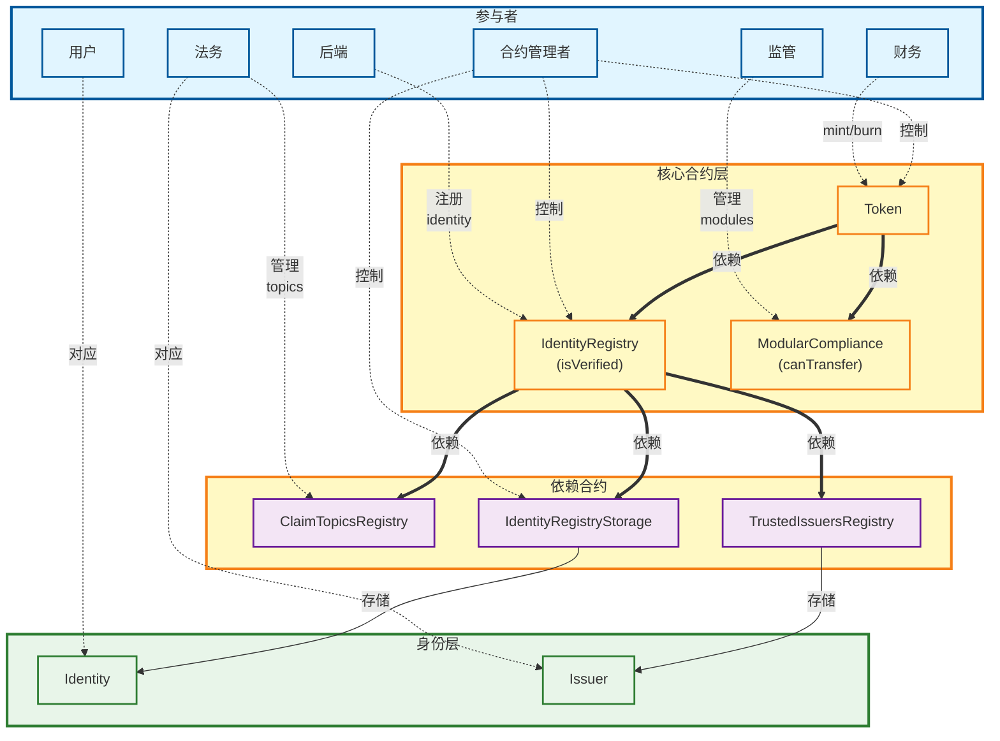

# 主要合约权限设计（暂定）

## 章节概览
- 合约管理者：升级与模块治理 (owner)
- 法务：合规策略与可信发行人治理（topic）
- 财务：资金流与 Token 代理操作(mint)
- 后端：身份/发行人基础设施运维(identity)
- 监管：合规模块接入与策略执行(compliance)
- 用户：转账 (transfer), 链上对应身份

## 权限关系示意

## 各部门职责概要
- 合约管理者：负责升级/模块管理类 Owner 权限（Token、IdentityRegistry、TREXGateway/Factory 等），保障合约可升级性与变更发布。
- 法务：负责合规模块、可信发行人及 Issuer 权限（ClaimTopicsRegistry、TrustedIssuersRegistry、Issuer 合约），确保合规策略与发行人治理。
- 财务：负责 Token Agent 权限，执行资金管理相关操作（转账、冻结/解冻等具体由业务设定）。
- 后端：负责身份与发行人网关/工厂类 Owner 或 TokenFactory 权限（IdentityIdFactory、IdentityGateway、IssuerIdFactory、IssuerGateway），支持账户/issuer 生命周期管理。
- 监管：负责 ModularCompliance Owner 权限，管理合规模块接入/移除与策略落地。
- 用户：持有 Identity/Issuer 的 manageKey/actionKey/claimKey，管理个人或发行人身份、执行授权与 Claim 维护。

### 合约管理者：升级与模块治理
- 负责 Owner 级权限：Token、IdentityRegistry、TREXGateway、TREXFactory、TREXImplementationAuthority 等。
- 核心任务：审批与执行合约升级、管理子模块绑定/解绑、发布新版本并维护变更记录。
- 关注点：变更窗口、回滚策略、兼容性验证（与前端/后端/合规模块的协同）。

### 法务：合规策略与可信发行人治理
- 负责 ClaimTopicsRegistry / TrustedIssuersRegistry / Issuer 合约的 Owner 或管理权限。
- 核心任务：制定与更新合规策略（topic 列表）、引入/移除可信发行人、审核发行人密钥管理。
- 关注点：跨辖区合规差异、发行人准入与吊销流程、审计追踪与证据留存。

### 财务：资金流与 Token 代理操作
- 负责 Token Agent 权限，用于资金类业务操作（如转账、冻结/解冻、批量操作视业务而定）。
- 核心任务：执行日常资金划拨、异常资金冻结、与风控/合规协同的审批流。
- 关注点：操作留痕、阈值与多签策略、紧急停用/撤销 Agent 的流程。

### 后端：身份/发行人基础设施运维
- 负责 IdentityIdFactory、IdentityGateway、IssuerIdFactory、IssuerGateway 的 Owner/TokenFactory 权限。
- 核心任务：创建/更新身份与发行人实体，维护网关配置，支撑账户与 issuer 的全生命周期。
- 关注点：接口稳定性、密钥轮换、与业务系统的权限对齐（最小必要授权）。

### 监管：合规模块接入与策略执行
- 负责 ModularCompliance Owner 权限，决定合规模块的添加/移除与参数治理。
- 核心任务：上线新合规模块、调整合规规则组合、验证模块兼容性。
- 关注点：规则变更对业务的影响评估、灰度与回滚、与法务的策略同步。

### 用户：身份与发行人密钥管理
- 持有 Identity / Issuer 的 manageKey (1) / actionKey (2) / claimKey (3)。
- 核心任务：管理自身或发行人身份，执行授权，维护/提交 Claim。
- 关注点：密钥安全、授权最小化、遗失与恢复流程（与后端/法务协同）。

## 权限表格

| 合约名称 | 角色/权限类型 | 权限描述 | 权限类别 | 负责部门 | 数量 |
|---------|-------------|---------|---------|---------|------|
| ClaimTopicsRegistry | Owner | 管理topic | 业务逻辑 | 法务 | 1 |
| TrustedIssuersRegistry | Owner | 管理issuer | 业务逻辑 | 法务 | 1 |
| ModularCompliance | Owner | 管理module | 业务逻辑 | 监管 | 1 |
| IdentityRegistry | Owner | 管理子模块 | 合约升级 | 合约管理者 | 1 |
| IdentityRegistry | Agent | 新用户注册 | 业务逻辑 | 后端 | n |
| IdentityRegistryStorage | Owner | 管理子模块 | 合约升级 | 合约管理者 | 1 |
| Token | Owner | 管理子模块 | 合约升级 | 合约管理者 | 1 |
| Token | Agent | 资金管理 | 业务逻辑 | 财务 | n |
| TREXImplementationAuthority | Owner | 管理子模块 | 合约升级 | 合约管理者 | 1 |
| TREXFactory | Owner | 管理子模块 | 合约升级 | 合约管理者 | 1 |
| TREXGateway | Owner | 管理子模块 | 合约升级 | 合约管理者 | 1 |
| TREXGateway | Agent | 管理子模块 | 合约升级 | 合约管理者 | 1 |
| IdentityIdFactory | Owner | 管理identity | 业务逻辑 | 后端 | 1 |
| IdentityIdFactory | TokenFactory | 管理Token identity | 业务逻辑 | 后端 | 1 |
| IdentityGateway | Owner | 管理identity | 业务逻辑 | 后端 | 1 |
| Identity | manageKey (1) | 最高权限，管理key，执行，管理claim | 业务逻辑 | 用户 | n |
| Identity | actionKey (2) | 执行权限，approve某些行为 | 业务逻辑 | 用户 | n |
| Identity | claimKey (3) | 执行权限，只能管理Claim | 业务逻辑 | 用户 | n |
| IssuerIdFactory | Owner | 管理issuer | 业务逻辑 | 后端 | 1 |
| IssuerIdFactory | TokenFactory | 管理Token issuer | 业务逻辑 | 后端 | 1 |
| IssuerGateway | Owner | 管理issuer | 业务逻辑 | 后端 | 1 |
| Issuer | manageKey (1) | 最高权限，管理key，执行，管理claim | 业务逻辑 | 法务 | n |
| Issuer | actionKey (2) | 执行权限，approve某些行为 | 业务逻辑 | 法务 | n |
| Issuer | claimKey (3) | 执行权限，只能管理Claim | 业务逻辑 | 法务 | n |