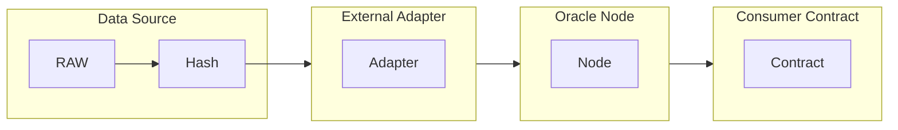
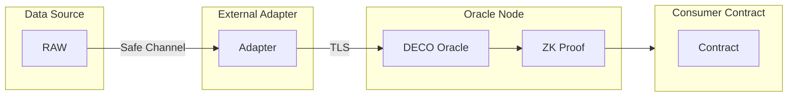
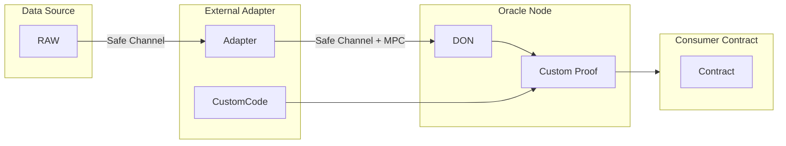

# Oracle

## Hash

## Chainlink DECO (Optional)

## Chainlink Functions (Optional)

# USDC

Value on Aggregator is almost same to chainlink page

## Aggregator
Address: https://etherscan.io/address/0x8fFfFfd4AfB6115b954Bd326cbe7B4BA576818f6#readContract

### latestRound

get the latest completed round where the answer was updated

55340232221128655514 uint256

### Oracle
https://data.chain.link/feeds/ethereum/mainnet/usdc-usd#operator-snzpool

