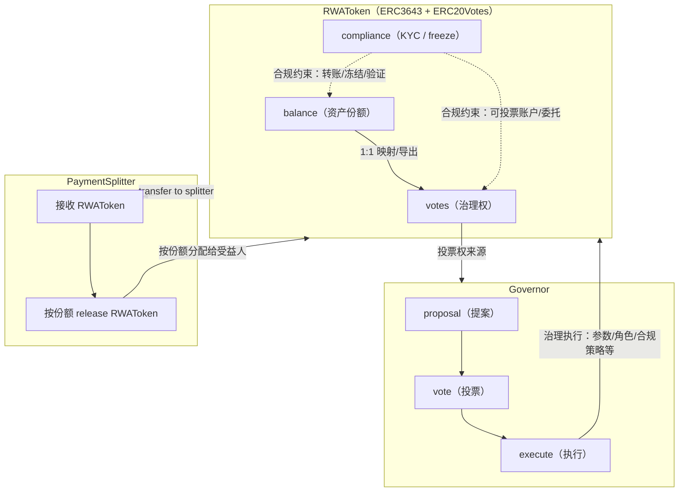

```mermaid
flowchart TB
  %% ======================
  %% SingleToken Architecture
  %% RWAToken (ERC3643 + ERC20Votes) + Governor + PaymentSplitter
  %% ======================

  subgraph TOKEN["RWAToken（ERC3643 + ERC20Votes）"]
    direction TB
    B["balance（资产份额）"]
    V["votes（治理权）"]
    C["compliance（KYC / freeze）"]
  end

  subgraph GOV["Governor"]
    direction TB
    P["proposal（提案）"]
    VT["vote（投票）"]
    EX["execute（执行）"]
    P --> VT --> EX
  end

  subgraph PS["PaymentSplitter"]
    direction TB
    RCV["接收 RWAToken"]
    REL["按份额 release RWAToken"]
    RCV --> REL
  end

  %% ===== Core relationships =====
  B -->|1:1 映射/导出| V
  C -.->|合规约束：转账/冻结/验证| B
  C -.->|合规约束：可投票账户/委托| V

  %% ===== Governance depends on votes =====
  V -->|投票权来源| GOV

  %% ===== Governor executes actions on token/system =====
  EX -->|治理执行：参数/角色/合规策略等| TOKEN

  %% ===== Payment flows =====
  TOKEN -->|transfer to splitter| RCV
  REL -->|按份额分配给受益人| TOKEN
```

