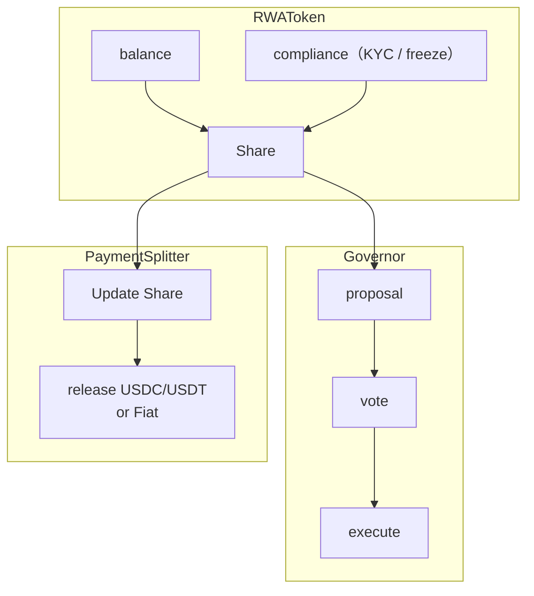
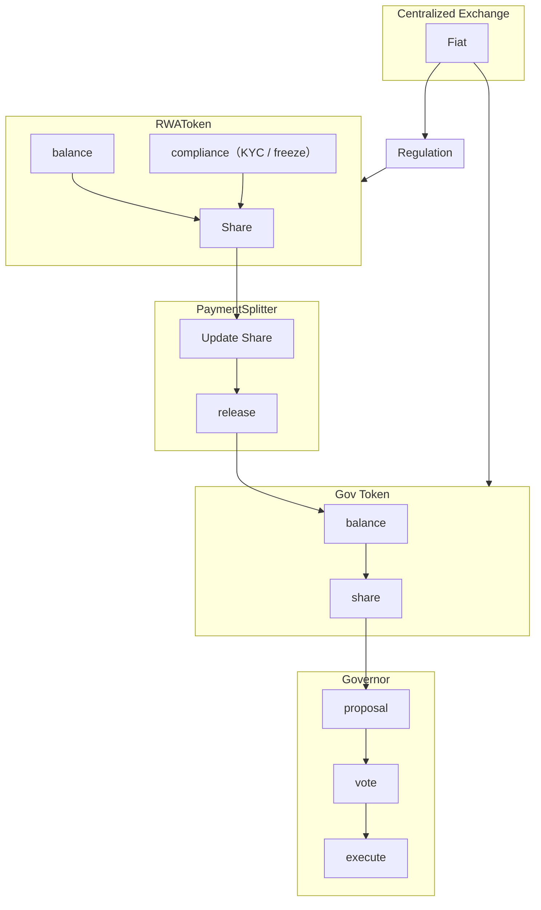

## Single Token

```mermaid
flowchart TB
  %% ======================
  %% SingleToken Architecture
  %% RWAToken (ERC3643 + ERC20Votes) + Governor + PaymentSplitter
  %% ======================

  subgraph TOKEN["RWAToken"]
    direction TB
    B["balance"]
    C["compliance（KYC / freeze）"]
    Share
    B --> Share
    C --> Share
  end

  subgraph GOV["Governor"]
    direction TB
    P["proposal"]
    VT["vote"]
    EX["execute"]
    P --> VT --> EX
  end

  subgraph PS["PaymentSplitter"]
    direction TB
    UPDATE["Update Share"]
    REL["release USDC/USDT <br/> or Fiat"]
    UPDATE --> REL
    
  end
  Share --> P
  Share --> UPDATE

```

## Double Token

```mermaid
flowchart TB

  subgraph TOKEN["RWAToken"]
    direction TB
    Share
    B["balance"]
    C["compliance（KYC / freeze）"]
    
    B --> Share
    C --> Share
    
  end

  subgraph GOV["Governor"]
    direction TB
    P["proposal"]
    VT["vote"]
    EX["execute"]
    P --> VT --> EX
  end

  subgraph GOVToken["Gov Token"]
    direction TB
    Bal["balance"]
    Sha["share"]
    Bal --> Sha
  end

  subgraph PS["PaymentSplitter"]
    direction TB
    UPDATE["Update Share"]
    REL["release"]
    UPDATE --> REL
    
  end

  subgraph Authority["Regulation"]
    direction TB
    
  end

  subgraph Cex["Centralized Exchange"]
    direction TB
    Fiat
    
    
  end


  Sha --> P
  Share --> UPDATE
  REL --> Bal

  Fiat --> Authority --> TOKEN
  Fiat -->  GOVToken


```