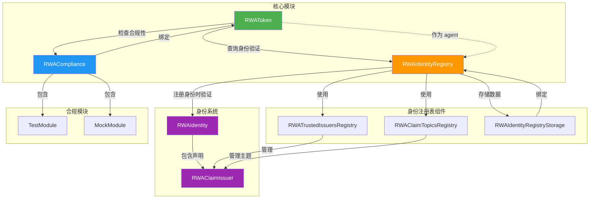

# Integration Test Setup 流程图

## 模块关系图

```mermaid
graph TB
    subgraph "核心模块"
        Token[RWAToken]
        Compliance[RWACompliance]
        IR[RWAIdentityRegistry]
    end
    
    subgraph "身份注册表组件"
        TIR[RWATrustedIssuersRegistry]
        CTR[RWAClaimTopicsRegistry]
        IRS[RWAIdentityRegistryStorage]
    end
    
    subgraph "身份系统"
        Identity[RWAIdentity]
        ClaimIssuer[RWAClaimIssuer]
    end
    
    subgraph "合规模块"
        TestModule[TestModule]
        MockModule[MockModule]
    end
    
    Token -->|查询身份验证| IR
    Token -->|检查合规性| Compliance
    IR -->|使用| TIR
    IR -->|使用| CTR
    IR -->|存储数据| IRS
    IRS -->|绑定| IR
    Compliance -->|绑定| Token
    Compliance -->|包含| TestModule
    Compliance -->|包含| MockModule
    IR -->|注册身份时验证| Identity
    Identity -->|包含声明| ClaimIssuer
    TIR -->|管理| ClaimIssuer
    CTR -->|管理主题| ClaimIssuer
    
    Token -.->|作为 agent| IR
    
    style Token fill:#4CAF50,color:#fff
    style Compliance fill:#2196F3,color:#fff
    style IR fill:#FF9800,color:#fff
    style Identity fill:#9C27B0,color:#fff
    style ClaimIssuer fill:#9C27B0,color:#fff
```