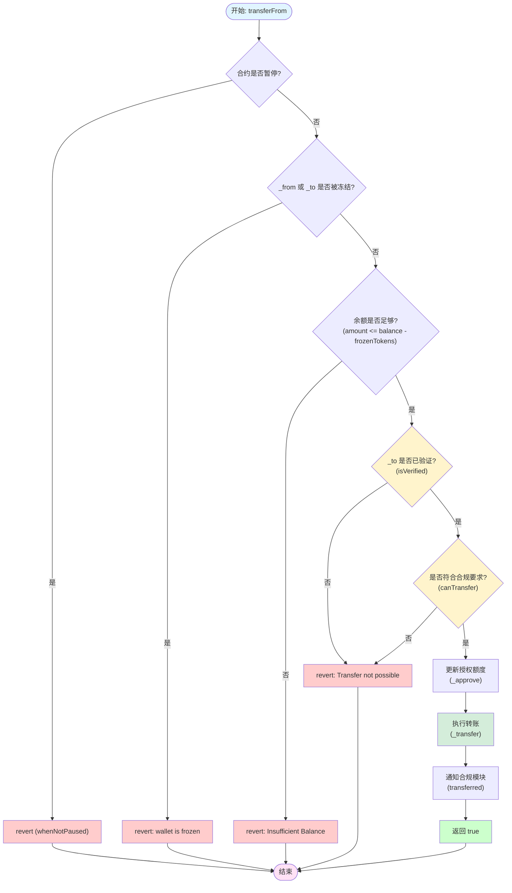

# transferFrom 函数流程图

```mermaid
flowchart TD
    Start(["开始: transferFrom"]) --> CheckPaused{"合约是否暂停?"}
    CheckPaused -->|"是"| Revert1["revert (whenNotPaused)"]
    CheckPaused -->|"否"| CheckFrozen{"_from 或 _to 是否被冻结?"}
    
    CheckFrozen -->|"是"| Revert2["revert: wallet is frozen"]
    CheckFrozen -->|"否"| CheckBalance{"余额是否足够?<br/>(amount <= balance - frozenTokens)"}
    
    CheckBalance -->|"否"| Revert3["revert: Insufficient Balance"]
    CheckBalance -->|"是"| CheckVerified{"_to 是否已验证?<br/>(isVerified)"}
    
    CheckVerified -->|"否"| Revert4["revert: Transfer not possible"]
    CheckVerified -->|"是"| CheckCompliance{"是否符合合规要求?<br/>(canTransfer)"}
    
    CheckCompliance -->|"否"| Revert4
    CheckCompliance -->|"是"| UpdateAllowance["更新授权额度<br/>(_approve)"]
    
    UpdateAllowance --> Transfer["执行转账<br/>(_transfer)"]
    Transfer --> NotifyCompliance["通知合规模块<br/>(transferred)"]
    NotifyCompliance --> ReturnTrue["返回 true"]
    
    Revert1 --> End(["结束"])
    Revert2 --> End
    Revert3 --> End
    Revert4 --> End
    ReturnTrue --> End
    
    style Start fill:#e1f5ff
    style End fill:#ffe1f5
    style Revert1 fill:#ffcccc
    style Revert2 fill:#ffcccc
    style Revert3 fill:#ffcccc
    style Revert4 fill:#ffcccc
    style ReturnTrue fill:#ccffcc
    style CheckVerified fill:#fff4cc
    style CheckCompliance fill:#fff4cc
    style Transfer fill:#d4edda
```

