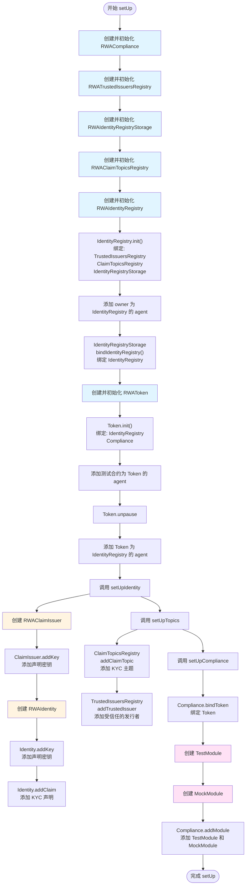
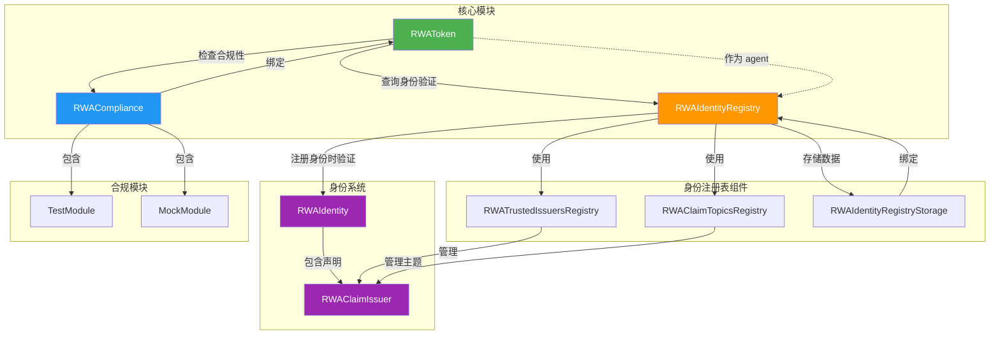
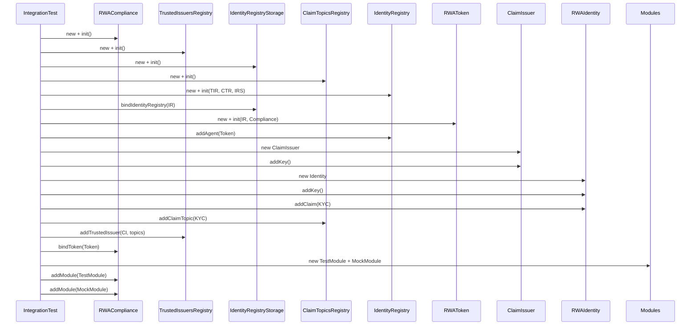

# Integration Test Setup 流程图

```mermaid
flowchart TD
    Start([开始 setUp]) --> InitCompliance[创建并初始化 RWACompliance]
    
    InitCompliance --> InitTIR[创建并初始化 RWATrustedIssuersRegistry]
    InitTIR --> InitIRS[创建并初始化 RWAIdentityRegistryStorage]
    InitIRS --> InitCTR[创建并初始化 RWAClaimTopicsRegistry]
    
    InitCTR --> InitIR[创建并初始化 RWAIdentityRegistry]
    InitIR --> BindIR["IdentityRegistry.init()<br/>绑定: TrustedIssuersRegistry<br/>ClaimTopicsRegistry<br/>IdentityRegistryStorage"]
    
    BindIR --> AddAgent1[添加 owner 为 IdentityRegistry 的 agent]
    AddAgent1 --> BindStorage["IdentityRegistryStorage<br/>bindIdentityRegistry()<br/>绑定 IdentityRegistry"]
    
    BindStorage --> InitToken[创建并初始化 RWAToken]
    InitToken --> BindToken["Token.init()<br/>绑定: IdentityRegistry<br/>Compliance"]
    
    BindToken --> AddAgent2[添加测试合约为 Token 的 agent]
    AddAgent2 --> Unpause[Token.unpause]
    Unpause --> AddAgent3[添加 Token 为 IdentityRegistry 的 agent]
    
    AddAgent3 --> SetupIdentity[调用 setUpIdentity]
    SetupIdentity --> SetupTopics[调用 setUpTopics]
    SetupTopics --> SetupCompliance[调用 setUpCompliance]
    
    SetupIdentity --> CreateClaimIssuer[创建 RWAClaimIssuer]
    CreateClaimIssuer --> AddClaimKey1[ClaimIssuer.addKey<br/>添加声明密钥]
    AddClaimKey1 --> CreateIdentity[创建 RWAIdentity]
    CreateIdentity --> AddClaimKey2[Identity.addKey<br/>添加声明密钥]
    AddClaimKey2 --> AddClaim[Identity.addClaim<br/>添加 KYC 声明]
    
    SetupTopics --> AddTopic[ClaimTopicsRegistry<br/>addClaimTopic<br/>添加 KYC 主题]
    AddTopic --> AddTrustedIssuer[TrustedIssuersRegistry<br/>addTrustedIssuer<br/>添加受信任的发行者]
    
    SetupCompliance --> BindCompliance[Compliance.bindToken<br/>绑定 Token]
    BindCompliance --> CreateTestModule[创建 TestModule]
    CreateTestModule --> CreateMockModule[创建 MockModule]
    CreateMockModule --> AddModules[Compliance.addModule<br/>添加 TestModule 和 MockModule]
    
    AddModules --> End([完成 setUp])
    
    style InitCompliance fill:#e1f5ff
    style InitTIR fill:#e1f5ff
    style InitIRS fill:#e1f5ff
    style InitCTR fill:#e1f5ff
    style InitIR fill:#e1f5ff
    style InitToken fill:#e1f5ff
    style CreateClaimIssuer fill:#fff4e1
    style CreateIdentity fill:#fff4e1
    style CreateTestModule fill:#ffe1f5
    style CreateMockModule fill:#ffe1f5
```

## 模块关系图

```mermaid
graph TB
    subgraph "核心模块"
        Token[RWAToken]
        Compliance[RWACompliance]
        IR[RWAIdentityRegistry]
    end
    
    subgraph "身份注册表组件"
        TIR[RWATrustedIssuersRegistry]
        CTR[RWAClaimTopicsRegistry]
        IRS[RWAIdentityRegistryStorage]
    end
    
    subgraph "身份系统"
        Identity[RWAIdentity]
        ClaimIssuer[RWAClaimIssuer]
    end
    
    subgraph "合规模块"
        TestModule[TestModule]
        MockModule[MockModule]
    end
    
    Token -->|查询身份验证| IR
    Token -->|检查合规性| Compliance
    IR -->|使用| TIR
    IR -->|使用| CTR
    IR -->|存储数据| IRS
    IRS -->|绑定| IR
    Compliance -->|绑定| Token
    Compliance -->|包含| TestModule
    Compliance -->|包含| MockModule
    IR -->|注册身份时验证| Identity
    Identity -->|包含声明| ClaimIssuer
    TIR -->|管理| ClaimIssuer
    CTR -->|管理主题| ClaimIssuer
    
    Token -.->|作为 agent| IR
    
    style Token fill:#4CAF50,color:#fff
    style Compliance fill:#2196F3,color:#fff
    style IR fill:#FF9800,color:#fff
    style Identity fill:#9C27B0,color:#fff
    style ClaimIssuer fill:#9C27B0,color:#fff
```

## 初始化顺序和绑定关系

```mermaid
sequenceDiagram
    participant Test as IntegrationTest
    participant Compliance as RWACompliance
    participant TIR as TrustedIssuersRegistry
    participant IRS as IdentityRegistryStorage
    participant CTR as ClaimTopicsRegistry
    participant IR as IdentityRegistry
    participant Token as RWAToken
    participant CI as ClaimIssuer
    participant Identity as RWAIdentity
    participant Modules as Modules
    
    Test->>Compliance: new + init()
    Test->>TIR: new + init()
    Test->>IRS: new + init()
    Test->>CTR: new + init()
    Test->>IR: new + init(TIR, CTR, IRS)
    Test->>IRS: bindIdentityRegistry(IR)
    Test->>Token: new + init(IR, Compliance)
    Test->>IR: addAgent(Token)
    
    Test->>CI: new ClaimIssuer
    Test->>CI: addKey()
    Test->>Identity: new Identity
    Test->>Identity: addKey()
    Test->>Identity: addClaim(KYC)
    
    Test->>CTR: addClaimTopic(KYC)
    Test->>TIR: addTrustedIssuer(CI, topics)
    
    Test->>Compliance: bindToken(Token)
    Test->>Modules: new TestModule + MockModule
    Test->>Compliance: addModule(TestModule)
    Test->>Compliance: addModule(MockModule)
```

